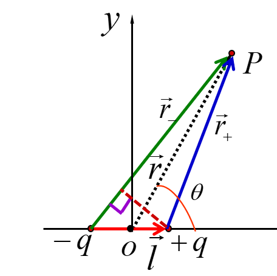
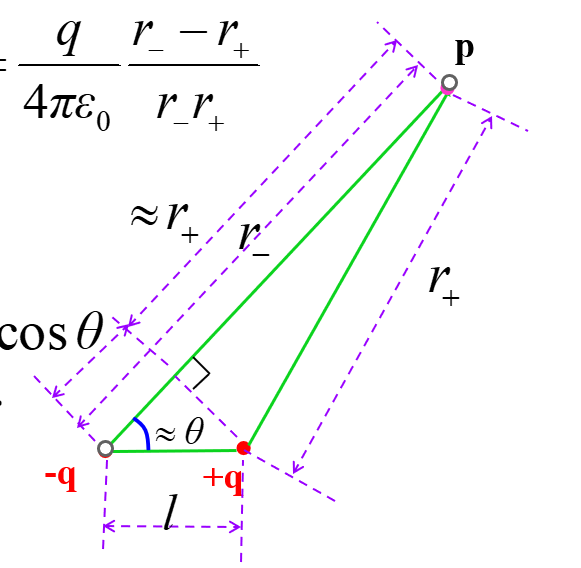
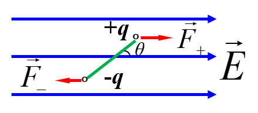

# Chapter 11 真空中的静电场

## 11.1 电学基本概念

### 库仑定律

$\boldsymbol{f}=\dfrac{q_1 q_2}{4 \pi \epsilon_0 r^2}\boldsymbol{e}_r$

### 电力叠加原理

$\boldsymbol{f} = \sum_{i=1}^n \boldsymbol{f}_i = \dfrac{1}{4 \pi \epsilon_0} \sum_{i=1}^n \dfrac{qq_i}{r_i^2} {\boldsymbol{e}_r}_i = \dfrac{1}{4 \pi \epsilon_0} \sum_{i=1}^n \dfrac{qq_i}{r_i^3} \boldsymbol{r}_i$

## 11.2 电场与电场强度

### 电场强度

$\boldsymbol{E} = \dfrac{\boldsymbol{f}}{q_0}$

### 电场强度的计算

- 点电荷的电场

$\boldsymbol{E} = \dfrac{\boldsymbol{f}}{q_0} = \dfrac{q}{4 \pi \epsilon_0 r^2}\boldsymbol{e}_r = \dfrac{q}{4 \pi \epsilon_0 r^3}\boldsymbol{r}$

- 点电荷系的电场

$\boldsymbol{E} = \sum_{i=1}^n \boldsymbol{E}_i =\dfrac{1}{4 \pi \epsilon_0} \sum_{i=1}^n \dfrac{q_i}{r_i^2} {\boldsymbol{e}_r}_i = \dfrac{1}{4 \pi \epsilon_0} \sum_{i=1}^n \dfrac{q_i}{r_i^3} \boldsymbol{r}_i$

- 连续分布电荷系统的电场

$\boldsymbol{E} = \int dE = \int \dfrac{dq}{4 \pi \epsilon_0 r^3} \boldsymbol{r} = \int \dfrac{dq}{4 \pi \epsilon_0 r^2} \boldsymbol{e}_r$

- 具体的集中情况
  - 电荷体密度为$\rho$的三维体电荷分布: $$dq = \rho dV$$ $$\boldsymbol{E} = \iiint \dfrac{\rho dV}{4 \pi \epsilon_0 r^3} \boldsymbol{r}$$
  - 电荷面密度为$\sigma$的二维面电荷分布：$$dq = \sigma dS$$ $$\boldsymbol{E} = \iint \dfrac{\sigma dS}{4 \pi \epsilon_0 r^3} \boldsymbol{r}$$
  - 电荷线密度为$\lambda$的一维线电荷分布：$$dq = \lambda dl$$ $$\boldsymbol{E} = \int \dfrac{\lambda dl}{4 \pi \epsilon_0 r^3} \boldsymbol{r}$$

## 11.3 高斯定理

### 电通量

通过面积元 $d \boldsymbol{S}$ 的电通量为

$d \Phi_e = \boldsymbol{E} \cdot d \boldsymbol{S}$

对于电场中任一封闭曲面$S$，电通量为

$\Phi_e = \oiint_S \boldsymbol{E} \cdot d\boldsymbol{S}$

### 高斯定理

$$\oiint_{S} \boldsymbol{E} \cdot d \boldsymbol{S} = \dfrac{1}{\epsilon_0} \sum_{i=1}{n} q_i$$

如果电荷分布是连续体分布，则有 $$\oiint_{S} \boldsymbol{E} \cdot d \boldsymbol{S} = \dfrac{1}{\epsilon_0} \iiint_{V} \rho dV$$

高斯定理可以方便地解决具有电荷分布具有**对称性**的情况。常见的**对称性**模型包括：
- 球对称
  - 均匀带电球面
  - 电荷分布为球对称的球体或球壳
- 柱对称
  - 无限长均匀带电圆柱体
  - 无限长均匀带电圆柱面
  - 无限长均匀带电直线
- 面对称
  - 无限大均匀带电平板
  - 无限大均匀带电平面

除了考虑模型的**对称性**，选取高斯面还要**注意**：
- 高斯面要经过所求场点
- 形状应该规则（方便计算）：球，柱
- 平行原则：尽可能使高斯面上的点的场强大小相等，且方向与高斯面法向方向一致
  - 这样的高斯面上$\oiint_{S} \boldsymbol{E} \cdot d \boldsymbol{S}$就可以直接简化为$E \cdot S$
- 垂直原则：尽可能使高斯面上的点的场强方向与高斯面法向垂直
  - 这样的高斯面上$\oiint_{S} \boldsymbol{E} \cdot d \boldsymbol{S} = 0$

## 11.4 电势

### 静电场环流定理
$$\oint_{L} \vec{E}d \vec{l} = 0$$
这说明静电场是保守力场

### 电势能

$$W_a = A_{a p_0} = \int_{a}^{p_0} q_0 \vec{E} d \vec{l} = q_0 \int_{a}^{p_0} \vec{E} d \vec{l}  = q_0 V_a$$
* $p_0$为零势能点或零势能面，一般默认无穷远处为电势零点，取$p_0= \infty$

### 电势差
$$V_{ab} = \dfrac{W_a-W_b}{q_0} = V_a - V_b = \int_{a}^b \vec{E} d \vec{l}$$

电势差与电场力做功的关系
$$A_{ab}=q \int_{a}^b \vec{E} d \vec{l} = q(V_a-V_b)$$

### 电势
$$V_a = \int_{a}^{p_0} \vec{E} d \vec{l}$$
* $p_0$为零势点或零势面，一般默认无穷远处为电势零点，取$p_0= \infty$
* （常用）面对称情况：$V=-\int Edx$
* （常用）球对称情况： $V=-\int Edr$

### 点电荷电势

$$V = \dfrac{q}{4 \pi \epsilon_0 r}$$

### 电势叠加原理

任意场点的电势等于各个点电荷在同一场点的代数和
$$V=\sum_{i=1}^{n}V_i$$
对于连续电荷分布带电体的电势，有
$$V=\int dV=\int \dfrac{dq}{4 \pi \epsilon_0 r}$$

### 电势与电场强度的微分关系

$$\boldsymbol{E} = - \nabla V$$
直角坐标系: $$\boldsymbol{E} = -(\dfrac{\partial V}{\partial x} \vec i+\dfrac{\partial V}{\partial y} \vec j+\dfrac{\partial V}{\partial z} \vec k)$$
平面极坐标系：$$\boldsymbol{E} = -(\dfrac{\partial V}{\partial r} \vec e_r+\dfrac{1}{r}\dfrac{\partial V}{\partial \theta} \vec e_\theta)$$

## 11.5 常用模型及解题技巧

### 电偶极子模型

 

定义电偶极矩：$\vec p = q \vec l$，且有 $p = ql$

电偶极子在P点的电势： $V = \dfrac{q}{4 \pi \epsilon_0}\dfrac{r_--r_+}{r_-r_+} \approx \dfrac{qlcos\theta}{4 \pi \epsilon_0 r^2}= \dfrac{\vec p \cdot \vec r}{4 \pi \epsilon_0 r^3} = \dfrac{p cos \theta}{4 \pi \epsilon_0 r^2}$

在对电势$V$求偏导得到电场强度：$\boldsymbol{E} = -(\dfrac{\partial V}{\partial r} \vec e_r+\dfrac{1}{r}\dfrac{\partial V}{\partial \theta} \vec e_\theta) =\dfrac{p cos \theta}{2 \pi \epsilon_0 r^3} \vec e_r + \dfrac{p sin \theta}{4 \pi \epsilon_0 r^3} \vec e_\theta = \dfrac{1}{4 \pi \epsilon_0 r^3}[- \vec p + \dfrac{3(\vec r \cdot \vec p)\vec r}{r^2}]$

力偶矩为$M = Fl sin\theta = qElsin \theta = pEsin \theta$, $\vec M = \vec p \times \vec E$

电势能为$W = W_+ + W_- = q(V_+ + V_-) = -qElcos \theta = -pE cos \theta= - \vec p \cdot \vec E$

### 几个重要模型的电场强度
这些结果是通过积分或者高斯定理求得的，有些在考场上建议记住结论直接用。当然，也要熟悉它们是如何推导出来的。

另外，对这些电场强度积分，就可以得到电势。

- 均匀带电的**无限长直线**，电荷线密度为 $\lambda$

$\boldsymbol{E(r)} = \dfrac{\lambda}{2 \pi \epsilon_0 r} \boldsymbol{e}_r = \dfrac{\lambda}{2 \pi \epsilon_0 r^2} \boldsymbol{r}$

- 带电量为$Q$，半径为$R$的**均匀带电细圆环**

$\boldsymbol{E} = \dfrac{xQ}{4 \pi \epsilon_0 (x^2+R^2)^{\frac{3}{2}}}$

- 电荷面密度为$\sigma$，半径为$R$的**均匀带电薄圆盘**的**轴线**上

$\boldsymbol{E} = \dfrac{\sigma}{2 \epsilon_0}(1-\dfrac{x}{\sqrt{x^2+R^2}})$

- **无限大均匀带电平面**

$\boldsymbol{E} = \dfrac{\sigma}{2 \epsilon_0} \boldsymbol{e}_n$

- 均匀**带电球面**
  $$
  \boldsymbol{E}=
  \begin{cases}
  \ 0 & r<R \\
  \ \dfrac{Q}{4 \pi \epsilon_0 r^2} \boldsymbol{e}_r & r>R \\
  \end{cases}
  $$

- 均匀**带电球体**
$$
\boldsymbol{E}=
\begin{cases}
\ \dfrac{Q}{4 \pi \epsilon_0 R^3} \boldsymbol{r} & r<R \\
\ \dfrac{Q}{4 \pi \epsilon_0 r^2} \boldsymbol{e}_r & r>R \\
\end{cases}
$$

- 无限长带电圆柱面
  $$
  \boldsymbol{E}=
  \begin{cases}
  \ 0 & r<R \\
  \ \dfrac{\lambda}{2 \pi \epsilon_0 r} \boldsymbol{e}_r & r>R \\
  \end{cases}
  $$

- 无限长带电圆柱体
$$
\boldsymbol{E}=
\begin{cases}
\ \dfrac{\lambda}{2 \pi \epsilon_0 R^2} \boldsymbol{r} & r<R \\
\ \dfrac{\lambda}{2 \pi \epsilon_0 r} \boldsymbol{e}_r & r>R \\
\end{cases}
$$

### 电场强度的计算思路

- 最基本方法：积分
  - 适用：没法用高斯定理的一般情况
  - 建立一个合适的坐标系
  - 确定电荷密度
  - 用电荷密度表示电荷元的电量$dq$（求$dq$）
  - 通过$dq$，计算电荷元的电场强度$d\boldsymbol{E}$（求dE）
  - 分解$d\boldsymbol{E}$为三个方向上的分量$d\boldsymbol{E}_x$ $d\boldsymbol{E}_y$ $d\boldsymbol{E}_z$
    - 显然，一维情况可以直接跳过这一步，二维情况只需两个分量
    - 对称性分析：对于二维或三维情况，往往能找到对称性，使其中某个方向的积分后结果显然为0。这样就能直接跳过这个方向分量的积分，简化计算
  - 整理变量，积分，求场强分量，得到电场强度
- 优先方法：高斯定理
  - 适用：对称性好的模型，或者**补偿法**得到的对称性好的模型
  - 找对称性
  - 选取高斯面（具体原则见前面）
  - 分析高斯面内电荷
  - $\oiint_{S} \boldsymbol{E} \cdot d \boldsymbol{S}$，情况好的话直接算$E \cdot S$
  - 代入公式，计算
- 电势求导/求偏导
  - 情况1：给了电势方程$V=V(x,y,z)$，那就直接$\boldsymbol{E} = - \nabla V$
  - 情况2：无法直接计算电场强度，或者电势比电场强度更方便计算
    - 先用电势叠加原理计算电势，然后再对电势求偏导得到电场强度的每个分量
    - 典型例子：电偶极子模型
    - 例子2：非均匀带电细圆环轴线上电场强度

### 电势的计算思路

- 最基本方法：电场强度积分
  - 先计算电场强度，然后代入$\int_{a}^{p_0} \vec{E} d \vec{l}$
- 电势叠加原理：
  - 先计算空间每个电荷元使得所计算点具有的电势$dV$，再对$dV$积分

### 电势为0等势面的求法

- 建立一个合适的坐标系
- 列出方程 $V_+ + V_-=0$
- 通过电势计算，把$V_+$和$V_-$计算出来，代入上述方程
- 化简，得到等势面方程

### 补偿法
- **补偿法**的目的是**恢复对称性**
  - 对于电场强度求解，这往往是为了使其适用高斯定理计算
  - 对于电势求解，这往往是为了拼合成已知模型
- 适用于那些一眼“挖孔”，从完整的图形里抠掉一块的题目
- 把挖空区域用完整的带原来电荷的区域+规则的带相反电荷区域等效替代
- 常见适合使用补偿法的模型：
  - 挖掉一个小球的大球
  - 半球问题
  - 半圆柱面问题
