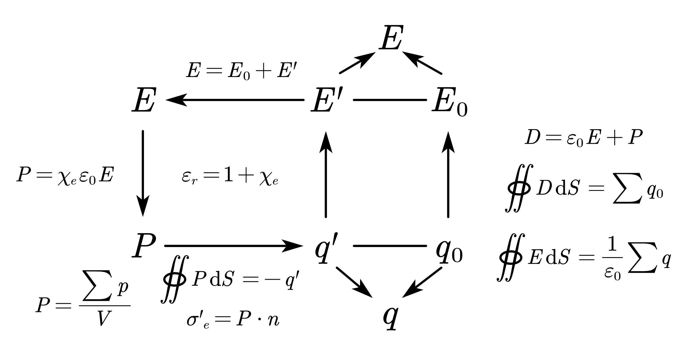

# Chapter 12 静电场与物质的相互作用

## 12.1 静电场中的导体

### 静电平衡
- 导体内部的场强处处为零
- 导体表面的场强垂直于导体表面
- 导体内部和导体表面处处电势相等。整个导体是个等势体，导体表面是个等势面。

## 12.2 静电场中的电介质

## 12.3 电容器

电容定义 $$C=\dfrac{q}{V}$$

通用的电容计算思路：
- 先设带电$Q$ 或者 先设电荷线密度$\lambda$或者面密度$\sigma$
- 计算电场强度$E$
- 用$E$积分计算电势差$U$
- 使用电容定义式$C=\dfrac{Q}{U}$计算电容器电容

### 孤立导体的电容

常规模型都很好算，不写了

### 电容器的电容

- 平板电容器：介质介电常数$\epsilon$，板面积$S$，板间距$d$ $$C=\dfrac{\epsilon S}{d}$$
  - 推广：填入多层介质（相当于电容串联）$$C=\dfrac{\epsilon_0 S}{\sum_{i} \dfrac{d_i}{{\epsilon_r}_i}}$$
  - 推广：插入电介质板（横向多层介质）（相当于电容并联）$$C=\dfrac{\epsilon S}{d} \dfrac{\sum_i \epsilon_{r_i}L_i}{\sum_i L_i} = \dfrac{\epsilon_0}{d} \sum_{i} \epsilon_{ri} S_i$$
  - 推广：放入多块导体板 $$C=\dfrac{\epsilon_0 S}{d - d'_1 - d'_2 - \cdots - d'_i}$$

- 柱形电容器（介质介电常数$\epsilon$，外径$R_2$，内径$R_1$）：$$C=\dfrac{2 \pi \epsilon l}{ln \dfrac{R_2}{R_1}}$$
  - 常见问题1：给定外径，内外电势差U，求最小电场强度E
    - 用U表示E
    - 求导，找极值
  - 常见问题2：给定外径，最大电场强度E，求最大电势差U
    - 用E表示U
    - 求导，找极值

- 球形电容器（介质介电常数$\epsilon$，内径$R_A$，外径$R_B$）：$$C=4 \pi \epsilon \dfrac{R_A R_B}{R_B-R_A}$$
  - 常见问题：给定外径，内外电势差U，求最小电场强度E
    - 思路和柱形那个完全一样

- 一些题目模型的思考
  - 两根平行长直导线单位长度的电容

### 电容器的连接

一般认为：
- 串联时，两个电容器带电量相等（部分题目会有不符合这个的特殊情况）
- 并联时，两个电容器电势差相等

- 串联 $$\dfrac{1}{C}= \sum_{i} \dfrac{1}{C_i}$$

- 并联 $$C = \sum_{i} C_i$$

- 前面的那种多种电介质情况建议都等效成串并联来算，结果都是对的，而且方便

### 出题常见模型中的问题

1. 电路断开或者根本没有连电路的情况下充入介质或取出介质，极板上所带电量$Q$不变，电势差$\Delta V$改变，电容储能$W_e$改变，$W_e$的改变是外力做功引起的。
2. 如果取出介质时候电势差$\Delta V$恒定，那么这个时候电容应该接入了电源，极板上所带电量$Q$也发生改变。这时候静电能$W_e$的改变量是是由外力做功和电流做功共同引起的，考虑的时候不要漏掉后者。

## 12.4 静电场的能量

### 带电体系的静电能

点电荷$q_0$处于$q$的电场中，相互作用电势能为
$$W_e=\dfrac{q_0q}{4 \pi \epsilon_0 r}$$

### 点电荷系的静电能

- 两个点电荷 $$W_e=\dfrac{q_1q_2}{4 \pi \epsilon_0 r} = \dfrac{1}{2}(q_1V_1+q_2V_2)$$
- n个点电荷系统的静电能 $$W_e=\dfrac{1}{2}\sum_{i=1}^n q_iV_i$$
- 连续带电体静电能 $$W_e=\dfrac{1}{2}\int_{Q} Vdq$$
  - 立体带电体 $$W_e=\dfrac{1}{2} \iiint_{\tau} V(\rho d \tau)$$
  - 平面带电体 $$W_e=\dfrac{1}{2} \iint_{S} V(\sigma dS)$$
  - 线状带电体 $$W_e=\dfrac{1}{2} \int_{L} V(\lambda dl)$$
  - 当然，你也可以使用定义计算
    - 计算每次移动$dq$到给定位置做的功
    - 对上述结果积分

考虑几个模型的静电能作为例子：
- 真空中的均匀带电球面
- 真空中的球形电容器
- 无限大均匀电介质中的均匀带电金属球
- 外界两种不同电介质中的均匀带电金属球

### 带电电容器的静电能

$$W_e=\dfrac{1}{2}Q\Delta V = \dfrac{1}{2} C (\Delta V)^2 = \dfrac{1}{2} \dfrac{Q^2}{C}$$
**请根据实际情况，自行选用最方便的公式进行计算**

- 考虑几个例子
  - 前面提到的几个填充多种介质的电容器静电能
    - 最简单粗暴的方法，你已经知道电容怎么算了，直接套上面的最后一个公式不就解决问题了

### 静电场的能量

静电场的能量密度 $$w_e = \dfrac{1}{2} \epsilon E^2 = \dfrac{1}{2} \boldsymbol{D} \cdot \boldsymbol{E}$$
空间区域$\Omega$内总的静电场能量 $$W_e = \iiint_{\Omega} w_e dV = \dfrac{1}{2} \iiint_{\Omega} \boldsymbol{D} \cdot \boldsymbol{E} dV = \dfrac{1}{2} \iiint_{\Omega} \epsilon E^2 dV$$

在球对称情况下计算静电场能量密度，常取$dV=4 \pi r^2 dr$，把以上三重积分变为一元常积分进行计算
