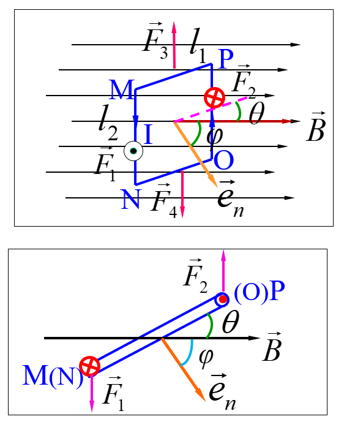
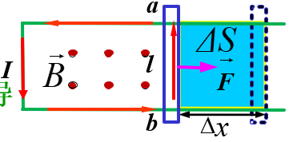

# Chapter13 电流与磁场

## 13.1 电流与电源

### 13.1.2 电流强度与电流密度矢量

电流强度
$$I=\dfrac{dq}{dt}$$

载流导体中任一点的**电流密度矢量**
**大小**：单位时间内流过该点所在的、且与该点正电荷定向移动方向垂直的单位面积截面的电量。
$$\left| \vec{j} \right| = \dfrac{dq}{dtdS_⊥} = \dfrac{dI}{dS_⊥}$$
**方向**：该点正电荷定向移动的方向
$$\vec{j} = \dfrac{dI}{dS_⊥} \vec{e_n}$$

**电流场**：导体内每一点都有对应的 $\vec{j}(x,y,z)$

### 13.1.3 电流连续性方程

1. **电流连续性方程**
由电荷守恒定律，单位时间内由S流出的净电量应等于S内电量的减少

$$\oiint_{S}\vec{j}\cdot d\vec{S} = -\dfrac{dq_{S内}}{dt}$$

2. **稳恒电流**
导体中各处的电流密度矢量不随时间变化
$$\dfrac{dq_{S内}}{dt} = 0 \quad \oiint_{S}\vec{j}\cdot d\vec{S} = 0$$
* 区分概念：**均匀电流**：导体中各处的电流密度矢量相同

### 13.1.4 金属导体中的电流密度矢量与载流子的平均漂移速度

设每个载流子电量为$q$，载流子数密度为$n$，平均漂移速度的大小$v_d$ \
在时间$\Delta t$内，柱体元内的自由电子将穿过截面$\Delta S$，易得以下结论：

$$\Delta I = qnv_d\Delta S$$
$$j=\dfrac{\Delta I}{\Delta S} = nqv_d$$
（$\rho_e=nq$ 电荷体密度）
$$\vec{j} = nq\vec{v_d} = \rho_e\vec{v_d}$$

### 13.1.5 欧姆定律：德鲁德模型

$$\vec{j} = \dfrac{ne^2\tau}{2m}\vec{E} = \gamma \vec{E}$$
(令$\gamma = \dfrac{ne^2\tau}{2m}$为电导率)

## 13.2 磁场及其基本描述量

### 13.2.1 磁场力：洛伦兹力
运动电荷在磁场中受力：
$$\vec{F} = q\vec{v} \times \vec{B}$$

## 13.3 电流产生的磁场：毕奥-萨伐尔定律

### 毕奥-萨伐尔定律

取电流元$I d\vec{l} = \vec{v_d}dq$
$$d\vec{B} = \dfrac{\mu_0}{4 \pi} \dfrac{Id\vec{l} \times \vec{r}}{r^3}$$（向量形式） 
$$dB = \dfrac{\mu_0}{4 \pi} \dfrac{Idl sin \theta}{r^2}$$（标量形式）
任意导线：
$$\vec{B} = \int d\vec{B} = \int \dfrac{\mu_0}{4 \pi} \dfrac{Id\vec{l} \times \vec{r}}{r^3}$$
载流回路：
$$\vec{B} = \oint_{l} d\vec{B} = \oint_{l} \dfrac{\mu_0}{4 \pi} \dfrac{Id\vec{l} \times \vec{r}}{r^3}$$

### 电流产生的磁感应强度的计算

解题基本逻辑：

1. 取电流元$I d\vec{l} $ ，套公式，计算由电流元产生的磁感应强度$d \vec{B}$
2. 判断$d \vec{B}$的方向，把它进行分解 $d\vec{B} \to dB_x,dB_y,dB_z$
3. 看一眼对称性，由对称性可以判断一些方向的分量积分以后显然为0，就不必算了
4. 对剩下的分量分部积分 $B_x=\int dB_x,B_y = \int dB_y,B_z = \int dB_z$

一些技巧：

- 对整体也善用对称性判断，有些对称性很好的电流，在其对称中心产生的$\vec{B}$显然为0，例如

  - 下面这个正方体电路在其中心产生的磁感应强度

  

  - 无限长均匀圆柱面在其对称轴上产生的磁感应强度

    

### 常见的电流产生的磁感应强度的模型

注：下面的磁感应强度都没指出方向，用的时候记得自己看一下方向！

- 直线段电流产生的磁场（模型如图所示，所计算点与直线距离为$a$，起终点$\vec{r}$与电流方向夹角分别为$\theta_1$，$\theta_2$）：

  
  $$
  B= \dfrac{\mu_0 I}{4\pi a}(cos \theta_1 - cos\theta_2)
  $$

- 特别地，无限长直线电流产生的磁场（所计算点与直线距离为$a$）：
  $$
  B = \dfrac{\mu_0 I}{2 \pi a}
  $$

- 显然，半无限长直线：
  $$
  B = \dfrac{\mu_0 I}{4 \pi a}
  $$

- 宽度为a的无限长平面，单位宽度电流为$\alpha$，求平面上方任一点（与平面距离$y$）的磁感应强度
  $$
  B = \dfrac{\mu_0 \alpha}{\pi} arctan \dfrac{a}{2y}
  $$

- 特别地（上式取$a \to \infty$），无限大均匀平面电流（电流线密度为$\alpha$）：
  $$
  B = \dfrac{\mu_0 \alpha}{2}
  $$

- 无限长均匀圆柱面电流的磁场（设与中轴距离为$r$）（用这个算起来贼烦，记一下结论吧）：
  $$
  B =
  \begin{cases}
  \ 0 & r<R \\
  \ \dfrac{\mu_0 I}{2 \pi r} & r>R \\
  \end{cases}
  $$

- 圆电流轴线上的磁场分布
  $$
  B = \dfrac{\mu_0 I R^2}{2(R^2+z^2)^{\frac{3}{2}}}
  $$
  

  特别地，当$z = 0$时，圆环中心磁感应强度
  $$
  B = \dfrac{\mu_0I}{2R}
  $$
  
- 圆弧电流在圆心处产生的磁感应强度
  $$
  B = \dfrac{\mu_0}{4\pi}\dfrac{IL}{R^2} = \dfrac{\mu_0}{4\pi}\dfrac{I}{R}\theta
  $$
  

- 密绕螺线管中的磁感应强度（其中$n$为螺线管单位长度匝数）
  $$
  B = \dfrac{\mu_0nI}{2}(cos\beta_2-cos\beta_1)
  $$

- 特别地，无限长螺线管
  $$
  B = \mu_0 nI
  $$

- 半无限长螺线管
  $$
  B = \dfrac{\mu_0 nI}{2}
  $$
  

## 13.4 磁场的基本规律

### 磁通量

$$
d \Phi_m = BdS_{⊥} = BdScos\theta = \vec{B} \cdot d\vec{S} \\
\Phi_m = \int d \Phi_m = \int_{S} \vec{B} \cdot d\vec{S} (= \iint_S \vec{B} \cdot d\vec{S})
$$

方向：（右手螺旋定则）用于计算磁通量$\Phi_m$的闭合回路的法线方向取为与回路电流绕向成右手螺旋关系

### 磁高斯定理

对于稳恒磁场来说，
$$
\oiint_{S}\vec{B} \cdot d\vec{S} = 0
$$

### 安培环路定理

对于稳恒电流产生的磁场来说，
$$
\oint_{L} \vec{B} \cdot d\vec{l} = \mu_0 \sum_{(L内)} I_i
$$

注意：

1. **用右手螺旋定则确定回路包围电流的正负**：如果穿过回路的电流与回路绕向成右旋（右手螺旋定则）关系，规定电流强度为正；反之为负。也就是说，满足右手螺旋为正，不满足右手螺旋为负。
2. 安培环路定理表达式中的磁感应强度$B$是闭合曲线内外所有电流产生的磁感应强度
3. 安培环路定理表达式中的电流强度$\sum I_i$是指闭合曲线所包围并穿过的电流强度，不包括闭合曲线以外的电流。

#### 安培环路定理的应用

基本逻辑：

1. 分析磁场的对称性
2. 根据磁场的对称性，选取安培环路
   - 安培环路要经过所求场点
   - 安培环路应选取规则形状，其上各B的量值恒定或为零。
   - 安培环路一般为同心圆周和矩形。
3. 用右手螺旋定则确定所选定的回路包围电流的正负，求出$\sum_{(L内)} I_i$
4. 由安培环路定理求解磁感应强度,并说明方向。
5. 其他技巧：灵活应用**叠加原理**和**“补偿法”**，目的是：**构造或者恢复对称性**，才能进行计算

### 重要的思想：等效电流

如果需要分析的问题涉及运动/转动的电荷产生的磁场，可以找一个合适的横截面，用$dI = \dfrac{dq}{t}$将运动/转动的电荷等效为电流进行计算

#### 几个安培环路定理的模型

- 无限长螺线管：内部磁场处处相等（$B=\mu_0nI$），外部磁场为零

  

- 载流螺绕环：电流$I$，导线总匝数$N$、内径$R_1$、外径$R2$
  $$
  B = \dfrac{\mu_0NI}{2\pi r} \quad (R_1<r<R_2)
  $$
  

- 无限长直流导线：常识，前面算过了，用安培环路定理更方便
  $$
  B = \dfrac{\mu_0I}{2\pi r}
  $$

- 无限长均匀圆柱面电流的磁场（设与中轴距离为$r$）（用安培环路定理算起来很快）
  $$
  B =
  \begin{cases}
  \ 0 & r<R \\
  \ \dfrac{\mu_0 I}{2 \pi r} & r>R \\
  \end{cases}
  $$

- 无限长均匀圆柱电流
  $$
  B =
  \begin{cases}
  \ \dfrac{\mu_0 I r}{2\pi R^2} & r<R \\
  \ \dfrac{\mu_0 I}{2 \pi r} & r \geq R \\
  \end{cases}
  $$

- 无限长均匀同轴电缆（内部导体圆柱电流$I$，外部导体壳电流$-I$）
  $$
  B =
  \begin{cases}
  \ \dfrac{\mu_0 I r}{2\pi R_1^2} & r<R_1 \\
  \ \dfrac{\mu_0 I}{2 \pi r} & R_1 \leq r<R_2 \\
  \ \dfrac{\mu_0 I}{2 \pi r} \dfrac{R_3^2-r^2}{R_3^2-R_2^2} & R_2 \leq r < R_3 \\
  \ 0 & r \geq R_3
  \end{cases}
  $$
  

- 无限大均匀平面电流（电流线密度为$\alpha$）：
  $$
  B = \dfrac{\mu_0 \alpha}{2}
  $$
  

- 无限长均匀通电圆柱体
  $$
  B = \dfrac{\mu_0}{2}\vec{j} \times \vec{r}
  $$

## 13.5 磁场对电流的作用

### 磁场力公式

一个电荷受力（洛伦兹力）：
$$
F = q \vec{v} \times \vec{B}
$$
电流元受力（安培力）：
$$
d \vec{F} = dq \vec{v_d} \times \vec{B} = I d\vec{l} \times \vec{B}
$$
安培力公式：
$$
\vec{F} = \int_{l} d\vec{F} = \int_{l} (I d\vec{l} \times \vec{B})
$$

注意：

1. 安培力乃大量自由电子洛伦兹力之和
2. 该定理涉及右手螺旋法则，方向如图
3. 计算时候善用**对称性**，可以少算一两个方向

对于匀强磁场中电流恒定（匀强磁场中的载流导线）情况，可以这样看安培力公式：
$$
\vec{F} = \int_{l} (I d\vec{l} \times \vec{B}) = I (\int_{l} d\vec{l}) \times \vec{B}
$$

### 相关题目

1. 计算安培力
2. 计算磁力矩
3. 计算安培力做功

### 几个安培力的模型

1. 两平行长直载流导线间的安培力
   $$
   \dfrac{dF_1}{dl_1} = \dfrac{dF_2}{dl_2} = \dfrac{\mu_0 I_1 I_2}{2 \pi a}
   $$
   

### 磁力矩与磁矩

载流线圈在匀强磁场中受到的磁力矩

垂直的两边受力
$$
F_1 = BIl_1 \quad F_2 = BIl_2
$$
线圈所受磁力矩
$$
M = F_1l_1 cos \theta = BIl_1l_2sin\phi = BIS sin\phi
$$
引入**磁矩**的概念（方向如图，遵循右手螺旋定则）
$$
\vec{m} = IS \vec{e_n}
$$
则**磁力矩**大小可以写成
$$
\vec{M} = m \vec{e_n} \times \vec{B} = \vec{m} \times \vec{B}
$$

若线圈有N匝，也可以得出
$$
\vec{M} = N \vec{m} \times \vec{B}
$$
还可得出，载流线圈在外磁场中的能量为
$$
W = -\vec{m} \cdot \vec{B} = mBcos\phi
$$

N匝时，有
$$
W = -N \vec{m} \cdot \vec{B} = NmBcos\phi
$$

### 安培力做功的计算

1. 运动的载流导线
   $$
   A = F \Delta x = Bl \Delta x = I \Delta \Phi_m = I (\Phi_{mf}- \Phi_{mi})
   $$

   

   其中$\Phi_m$指扫过的面积的磁通量的增量

2. 转动的载流线圈
   $$
   dA = -Md\phi = I d\Phi_m \\
   A = I \Delta \Phi_m = I (\Phi_{mf}- \Phi_{mi})
   $$
   P.S. 始末状态磁通量$\Phi_m$（尤其要注意方向）的计算，参见前面讲过的磁通量计算部分

## 13.6 带电粒子的运动与磁场

### 运动带电粒子的磁场

$$
d\vec{B} = \dfrac{\mu_0}{4 \pi} \dfrac{Id\vec{l} \times \vec{r}}{r^3} = \dfrac{\mu_0}{4 \pi} \dfrac{dq\vec{v} \times \vec{r}}{r^3}
$$

$$
\vec{B} = \int \dfrac{\mu_0}{4 \pi} \dfrac{\vec{v} \times \vec{r}}{r^3} dq
$$

评价是卵用没有，建议等效成电流用安培环路定理，计算简单很多

### 带电粒子在匀强磁场中的运动

1. $\vec{v} // \vec{B}$

   显而易见$F = 0$，没啥好说的，粒子匀速直线运动

2. $\vec{v} ⊥ \vec{B}$

   粒子做匀速直线运动，可得下面的结论
   $$
   F = qvB \\
   $$
   

   粒子的运动半径（Larmor半径）为
   $$
   R = \dfrac{mv}{qB}
   $$
   运动周期T为
   $$
   T = \dfrac{2\pi R}{v} = \dfrac{2 \pi m}{qB}
   $$

3. $\vec{v}$与$\vec{B}$成$\theta$角

   这种情况下，粒子在平行于磁场方向不受力

   在垂直于磁场方向作匀速圆周运动

   可以求出半径和运动周期
   $$
   R = \dfrac{mv_{⊥}}{qB} = \dfrac{mvsin\theta}{qB} \\
   T = \dfrac{2 \pi m}{qB}
   $$
   合成以后是个螺旋线运动，螺距
   $$
   h = v_{∥}T = \dfrac{2 \pi mv cos \theta}{qB}
   $$

### 霍尔效应

如果磁场方向与电流方向垂直，则在与磁场B和电流I两者垂直的方向上出现横向电势差，这一现象称为霍尔效应。这个电势差称为**霍尔电势差**。

#### 霍尔电势差大小计算

下面推导一下霍尔电势差大小：
$$
\vec{F_m} + \vec{F_e} = 0 \implies qv_dB = qE \implies V_m- V_n = Eb = Bv_db \\
且 I = n_q v_d bd \implies v_d = \dfrac{I}{nqbd} \\
\implies \Delta V_H = V_m - V_n = \dfrac{1}{nq} \dfrac{BI}{d} \\
set \thinspace R_h = \dfrac{1}{nq} \implies \Delta V_H = R_h \dfrac{BI}{d}
$$
记一下**结论**：
$$
\Delta V_H = \dfrac{1}{nq} \dfrac{BI}{d} = R_H \dfrac{BI}{d} (set \thinspace R_H = \dfrac{1}{nq})
$$

#### 霍尔电势差方向判断

和上面的计算思路很类似

1. 判断载流子所受洛伦兹力方向
2. 由于载流子所受电场力要与洛伦兹力抵消，霍尔电场对载流子的电场力和洛伦兹力反向
3. 由霍尔电场对载流子的电场力方向，可知霍尔电场强度方向
4. 有霍尔电场强度方向之后，就可以得到霍尔电势差的方向（沿电场强度方向，电势降低）

**注意**：一般来说，导体的**载流子**默认是**电子，带负电**！！！

## 14章内容补充

