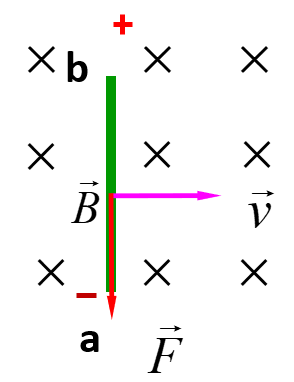
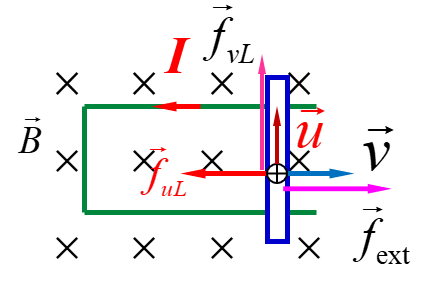
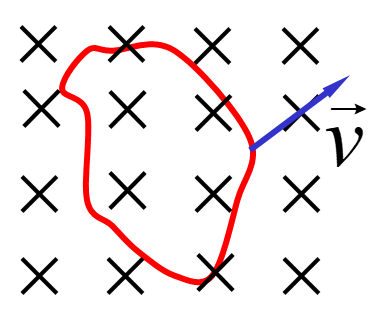
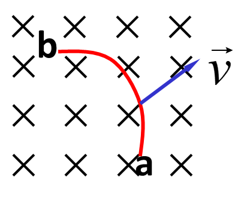
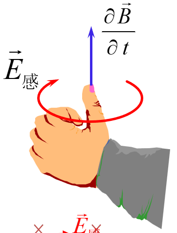
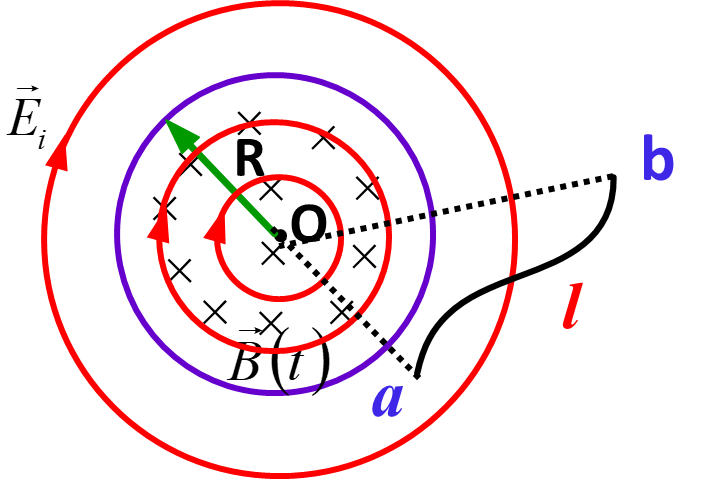
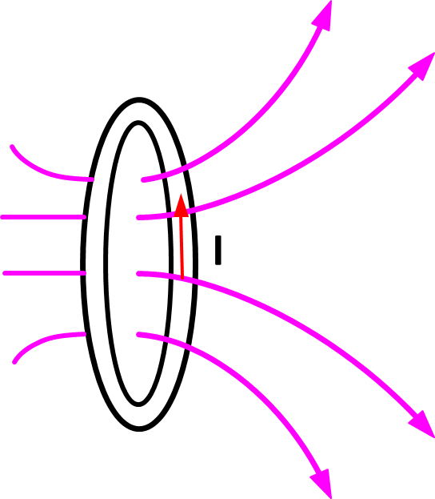
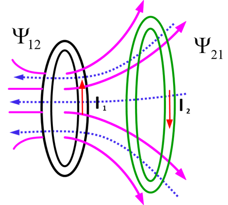

# Chapter 15 电磁感应

## 15.1 电磁感应定律

### 楞次定律

感应电动势产生的感应电流的方向总是使感应电流的磁场通过回路的磁通量阻碍原磁通量的变化。

常识，不多赘述

### 法拉第电磁感应定律

$$
\epsilon = -k\dfrac{d\Phi}{dt}
$$

国际单位制中，$k=1$，故可以直接写成
$$
\epsilon = -\dfrac{d\Phi}{dt}
$$
注意：

- 负号表示感应电动势的方向，即感应电动势总是与回路内磁通量随时间变化率的正负相反。

- 当线圈有$N$匝时，可以这样看：
  $$
  \epsilon = \sum_{i} \epsilon_i = - \dfrac{d}{dt}(\sum_{i = 1}^{n} \Phi_m)  = - \dfrac{d \Psi}{dt} \\
  \Psi = \sum_{i = 1}^{n} \Phi_m = N \Phi_m \quad (当各匝相同时)
  $$

- 可以从该式推导出一些二级结论：
  $$
  I = \dfrac{\epsilon }{R} = -\dfrac{1}{R}\dfrac{d \Phi}{dt} = \dfrac{dq}{dt} \\
  \implies q = \int_{t_1}^{t_2} Idt = -\dfrac{1}{R} \int_{\Phi_1}^{\Phi_2} d\Phi = -\dfrac{1}{R}(\Phi_2 - \Phi_1) = -\dfrac{1}{R} \Delta \Phi \\
  多匝情况: q = -\dfrac{1}{R}(\Psi_2 - \Psi_1) = -\dfrac{1}{R} \Delta \Psi
  $$
  

#### 感应电动势的方向判断

1. 首先选定回路L的绕行方向
2. 按照右手螺旋关系确定出回路的正法线方向
3. 确定通过回路的磁通量的正负
4. 确定磁通量的时间变化率的正负
5. 最后确定感应电动势的正负
   - $\epsilon < 0$ 则$\epsilon$与回路 *L*绕向相反
   - $\epsilon > 0$ 则$\epsilon$与回路 *L*绕向相同

当然，用楞次定律判断也是可以的（更加方便）

#### 解题基本思路

对于求$\epsilon$的题目，基本思路：

1. 确定磁感应强度的来源，根据安培环路定理（或者毕奥·萨伐尔定律）求出$\vec{B}$
2. 找到产生电动势的闭合回路，对上一问求出的$\vec{B}$积分，求出通过该闭合回路的磁通量$\Phi_m = \iint_s{\vec{B}\cdot d\vec{S}}$
3. 最后，使用电磁感应定律，求出电动势$\epsilon = - \dfrac{d\Phi_m}{dt}$

## 15.2 动生电动势

动生电动势是因为导体自身在磁场中做切割磁感线运动而产生的感应电动势。动生电动势由洛伦兹力产生，可以推出
$$
\vec{E_k} = \dfrac{\vec{F}}{q} = \vec{v} \times \vec{B} \\
\implies \epsilon = \int_{a}^{b} \vec{E_k} \cdot d\vec{l} = \int_{a}^{b} (\vec{v} \times \vec{B}) \cdot d\vec{l}
$$

故动生电动势为
$$
\epsilon = \int_{\vec{l}} (\vec{v} \times \vec{B}) \cdot d\vec{l}
$$
注意：

1. 积分路径$\vec{l}$的正方向可任意定。
2. 电动势“方向”的判断
   - $\epsilon < 0$ 则$\epsilon$与积分路径$\vec{l}$的正方向相反
   - $\epsilon > 0$ 则$\epsilon$与积分路径$\vec{l}$的正方向相同

### 动生电动势能量转化分析

洛伦兹力产生动生电动势，但是洛伦兹力垂直于运动电荷的速度，洛伦兹力本身并不做功！

载流子所受总的洛伦兹力为
$$
\vec{F} = q(\vec{v}+\vec{u})\times \vec{B} = q\vec{v} \times \vec{B} + q\vec{u} \times \vec{B} = \vec{f}_{vL} + \vec{f}_{uL}
$$
达到平衡时，洛仑兹力与外力相等
$$
\vec{f}_{ext} = - \vec{f}_{uL}
$$
电子所受的总的洛伦兹力与其速度垂直，对电子不作功
$$
\vec{F} \cdot (\vec{v}+\vec{u}) = 0 = \vec{f}_{vL} \cdot \vec{u} + \vec{f}_{uL} \cdot \vec{v}\\
\implies \vec{f}_{vL} \cdot \vec{u} = - \vec{f}_{uL} \cdot \vec{v}= \vec{f}_{ext} \cdot \vec{v}
$$
从这个式子中，我们可以很好地理解动生电动势的能量转化的本质：

- $\vec{f}_{ext} \cdot \vec{v}$：外力做正功输入机械能
- $- \vec{f}_{uL} \cdot \vec{v}$：洛仑兹力的一个分量做负功吸收它
- $\vec{f}_{vL} \cdot \vec{u}$：洛仑兹力的另一个分量做正功又以电能形式输出这个份额的能量

总结：外力克服洛仑兹力的一个分量做功，通过洛伦兹力的另一个分量转化为感应电流的能量。形象一点说，洛伦兹力本身并不做功，它是一个能量的转化器/搬运工。

### 动生电动势的具体计算

#### 对于导线回路

$$
\epsilon = \oint_{l} (\vec{v} \times \vec{B}) \cdot d\vec{l}
$$

#### 对于一般导线

$$
\epsilon = \int_{a}^{b} (\vec{v} \times \vec{B}) \cdot d\vec{l}
$$

#### 解题思路

1. 建立坐标系，取微元$d\vec{l}$，人为规定$d\vec{l}$正方向
2. 利用$d\epsilon = (\vec{v} \times \vec{B}) \cdot d\vec{l}$先计算出微元的电动势$d\epsilon$
3. 把$d\epsilon$积分，得到$\epsilon$
4. 若算得$\epsilon$为正值，说明实际电动势的方向就是规定的正方向，若为负值，说明与正方向相反
5. 注意：微元$d\vec{l}$产生动生电动势的方向为该点$\vec{v} \times \vec{B}$沿$d\vec{l}$的投影方向。

## 15.3 感生电动势 感应电场（涡旋电场）

利用法拉第电磁感应定律，可以将感生电动势表示为如下形式（法拉第-麦克斯韦方程）
$$
\epsilon = \oint_{l} \vec{E_i} \cdot d\vec{l} = - \dfrac{d \Phi_m}{dt} = - \dfrac{d}{dt} \iint_{S} \vec{B} \cdot d \vec{S} = - \iint_{S} \dfrac{\partial \vec{B}}{\partial t} \cdot d \vec{S}
$$
由此可以得出感生电场强度的环流公式
$$
\oint_{l} \vec{E_i} \cdot d\vec{l} = - \iint_{S} \dfrac{\partial \vec{B}}{\partial t} \cdot d \vec{S}
$$
借助stokes定理，可以写出该式子的微分形式
$$
\nabla \times \vec{E_i} = - \dfrac{\partial \vec{B}}{\partial t}
$$
方向：$\vec{E_i}$和$\dfrac{\partial \vec{B}}{\partial t}$构成左旋关系（$\vec{E_i}$和$- \dfrac{\partial \vec{B}}{\partial t}$构成右旋关系）

### 感生电动势（涡旋电场）的计算

#### 方法1：先算感应电场强度，再积分得到感生电动势

1. 先计算感生电场$\vec{E_i}$。计算公式：法拉第-麦克斯韦方程
   $$
   \oint_{l} \vec{E_i} \cdot d\vec{l} = - \iint_{S} \dfrac{\partial \vec{B}}{\partial t} \cdot d \vec{S}
   $$

2. 从上面的式子可以看倒，感生电场$\vec{E_i}$要有柱对称性才能计算

   - 获取柱对称性的方法：空间均匀的磁场被限制在一个圆柱体内，磁感应强度方向平行柱轴，如长直螺线管内部的场。这样的场具有柱对称性

3. 一旦计算出来感应电场，就可以通过积分计算任意曲线l上的感生电动势
   $$
   \epsilon = \int_{l} \vec{E_i} \cdot d\vec{l}
   $$

#### 方法2：补偿法，把导线补全成回路计算

**重要结论** 圆柱电磁场半径方向（法向）上的感生电动势为零

举个例子：下图中的Oa，Ob方向上的感生电动势就为0
$$
\epsilon_{oa} = \epsilon_{ob} = 0
$$

利用上述结论，有以下方法：

1. **补偿法**：补上半径方向（法向）的线段构成回路

2. 确定磁感应强度的来源，根据安培环路定理（或者毕奥·萨伐尔定律），计算出$\vec{B}$

3. 计算出回路磁通量$\Phi_m$
   $$
   \Phi_m = \iint_{S} \vec{B} \cdot d\vec{S}
   $$

4. 直接使用法拉第电磁感应定律，计算感生电动势
   $$
   \epsilon_{oab} = - \dfrac{d \Phi_{oab}}{dt} = \epsilon_{oa} + \epsilon_{ob} + \epsilon_{ab} = \epsilon_{ab}
   $$

#### 方法选择

- 对于导线
  - 补偿法，然后方法2
  - 方法1
- 对于回路
  - 基本都是直接方法2

### 既有动生电动势，又有感生电动势的计算

#### 方法1：构造一个回路（可以使用补偿法），直接使用法拉第电磁感应定律

1. 确定磁感应强度的来源，根据安培环路定理（或者毕奥·萨伐尔定律），计算出$\vec{B}$
2. 根据$\vec{B}$，写出回路磁通量$\Phi_m$

2. 然后直接用法拉第电磁感应定律的公式

$$
\Phi_m = \iint_{S} \vec{B} \cdot d\vec{S} \quad
\epsilon = - \dfrac{d \Phi_m}{dt}
$$

注意方向：

- S是以L为边界的任意面

- L的正绕向与S的法向成右手螺旋关系

#### 方法2：分开计算并相加

$$
\epsilon = \epsilon_{动} + \epsilon_{感} \\
\epsilon_{动} = \int_{\vec{l}} (\vec{v} \times \vec{B}) \cdot d\vec{l} \quad
\epsilon_{感} = \int_{l} \vec{E_i} \cdot d\vec{l}
$$

#### 方法选择

- 对于回路
  - 基本都是直接方法1
- 对于导线
  - 补偿法，然后方法1
  - 方法2（其实很少用）

## 15.4 自感与互感

### 自感的定义

**自感现象**：因线圈中电流变化而在线圈自身所引起的电磁感应现象。

**自感电动势**：自感现象中产生的感应电动势。不难发现，自感电动势产生的感应电流的方向总是阻碍原电流强度的变化。
$$
\Psi = \sum_{i} \Phi_{mi} \\
B \propto I \implies \Phi \propto I \implies \Psi \propto I
$$
故我们可以把$\Psi$写成
$$
\Psi = LI \implies L = \dfrac{\Psi}{I}
$$
其中$L$就称为回路的**自感**，这就是自感$L$的定义

规定回路正方向与电流方向一致，故有$L > 0$

**自感**由回路的形状、大小及周围介质决定，是线圈自身的**固有属性**
$$
\epsilon = -\dfrac{d\Psi}{dt} = - \dfrac{d(LI)}{dt} = -L\dfrac{dI}{dt} - I\dfrac{dL}{dt}
$$

- L变化：线圈有变形或者运动
- L不变：线圈静止，没有变形

若**L不变**，可以得到
$$
\epsilon_L = -L \dfrac{dI}{dt} \quad
L = - \dfrac{\epsilon_L}{\frac{dI}{dt}}
$$

### 自感的计算方法

#### 正常方法

1. 设线圈中通过电流$\vec{I}$
2. 计算电流在空间的磁场$\vec{B}$
3. 求出通过线圈回路的磁通量$\Psi$
4. 用定义式求出$L = \dfrac{\Psi}{I}$

#### 从能量角度计算（很少用）

$$
W_m = \dfrac{1}{2} LI^2 = \int_{V} \dfrac{1}{2}\dfrac{B^2}{\mu} dV = \int_{V} w_m dV
$$

### 互感的定义

**互感现象**：由于一个载流回路中电流变化，引起邻近另一回路中产生感生电动势的现象

**互感电动势**：互感现象中产生的感应电动势。

$$
I_1变化\implies 线圈2 \Psi_{21}变化 \implies 线圈2中产生\epsilon_{21} \\
I_2变化\implies 线圈1 \Psi_{12}变化 \implies 线圈1中产生\epsilon_{12}
$$

$$
\Psi_{21} = M_{21}I_1 \quad
\Psi_{12} = M_{12}I_2 \\
M_{12} = M_{21} = M
$$

互感系数$M$的定义为
$$
M = \dfrac{\Psi_{21}}{I_1} = \dfrac{\Psi_{12}}{I_2}
$$

- M变化：线圈有变形或者运动
- M不变：线圈静止，没有变形

若**M不变**，
$$
\epsilon_{21} = -\dfrac{d\Psi_{21}}{dt} = -M\dfrac{d I_1}{dt} \quad
\epsilon_{12} = -\dfrac{d\Psi_{12}}{dt} = -M\dfrac{d I_2}{dt}\\
M = - \dfrac{\epsilon_{21}}{\frac{dI_1}{dt}} = - \dfrac{\epsilon_{12}}{\frac{dI_2}{dt}}
$$

### 互感的计算方法

1. 设线圈1（或线圈2）中通过电流$\vec{I_1}$（或$\vec{I}_2$）
2. 计算电流在空间的磁场$\vec{B_1}$或$\vec{B_2}$
3. 求出通过另一线圈回路的磁通量$\Psi_{21}$或$\Psi_{12}$
4. 用定义式求出$M = \dfrac{\Psi_{21}}{I_1} \space or \space M= \dfrac{\Psi_{12}}{I_2}$

## 15.5 磁场能量

### 自感线圈磁能

$$
W_m = \dfrac{1}{2} LI^2
$$

### 互感线圈磁能

$$
W_m = \pm \lvert M \rvert I_1 I_2
$$

符号：

- 线圈中产生的磁通互相增强：+
- 线圈中产生的磁通互相削弱：-

### 两个线圈总磁能

把自感，互感相加就好
$$
W_m = \dfrac{1}{2} L_1I_1^2 + \dfrac{1}{2} L_2I_2^2 \pm \lvert M \rvert I_1 I_2
$$

### 空间任意磁场

#### 磁场能量密度

$$
w_m = \dfrac{1}{2}\vec{B} \cdot \vec{H}
$$

对于各向同性介质，可以进一步写成
$$
w_m = \dfrac{1}{2}\dfrac{B^2}{\mu} = \dfrac{1}{2}\mu H^2 = \dfrac{1}{2} BH
$$

#### 空间任意磁场能量

$$
W_m = \iiint_{V} w_mdV = \dfrac{1}{2} \iiint_{V} \vec{B} \cdot \vec{H} dV
$$

对于各向同性介质，可以进一步写成
$$
W_m = \dfrac{1}{2} \iiint_{V} \dfrac{B^2}{\mu}dV = \dfrac{1}{2} \iiint_{V} \mu H^2 dV = \dfrac{1}{2} \iiint_{V} BH dV
$$
