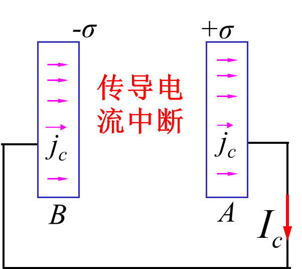
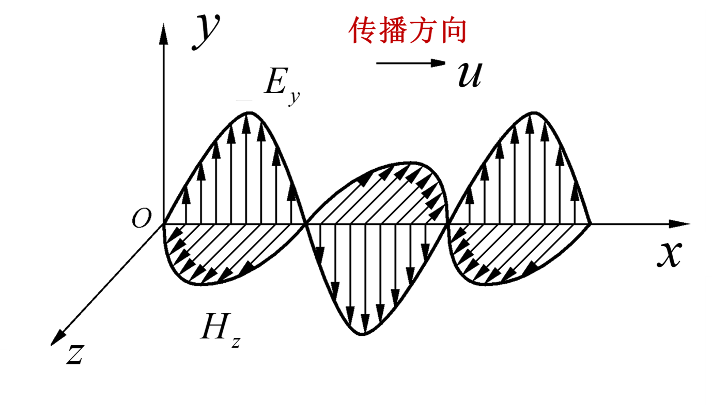
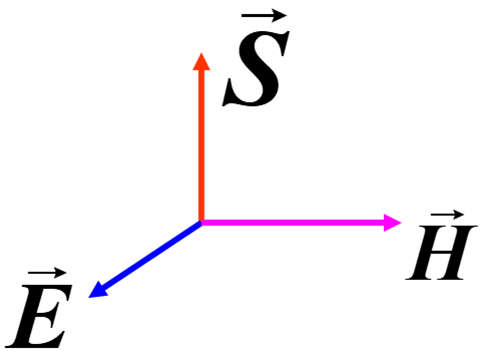
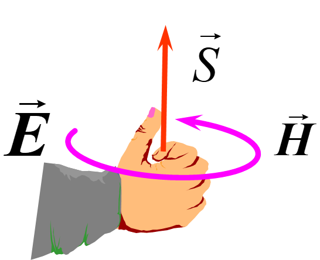

# Chapter16 电磁场与电磁波

## 16.1 麦克斯韦电磁理论

### 位移电流假设

$$
I_c = \dfrac{dq}{dt} = S\dfrac{d \sigma}{dt} = S j_c \implies j_c = \dfrac{d \sigma}{dt} \\
又由高斯定理，\oiint_{S} \vec{D} \cdot d\vec{S} = D \Delta S = q = \sigma \Delta S \implies D = \sigma \\
电位移矢量的通量\Phi = SD = S \sigma = q\\
\implies I_c = S j_c = S\dfrac{d \sigma}{dt} = \dfrac{d \Phi}{dt} = S\dfrac{dD}{dt}
$$
故可以如下定义位移电流和位移电流密度
$$
I_d = S\dfrac{d\vec{D}}{dt} \quad \vec{j_d} = \dfrac{\partial \vec{D}}{\partial t}
$$
并可以得到
$$
\Phi = \iint_{S} \vec{D} \cdot d\vec{S}\\
I_d = \dfrac{d \Phi}{dt} = \iint_{S} \vec{j_d} \cdot d\vec{S}
$$

### 全电流连续性原理

若电路中同时存在传导电流$I_c$和位移电流$I_d$，传导电流和位移电流之和称为全电流
$$
I_s = I_c + I_d
$$
对于任何电路（闭合回路），全电流是处处连续的
$$
\oiint_{S}(\vec{j_c}+\vec{j_d})\cdot d\vec{S} = 0 \quad
\nabla \cdot (\vec{j_c} + \vec{j_d}) = 0
$$

## 16.2 电磁波

### 麦克斯韦方程组

$$
\begin{cases}
\oint_{l} \vec{H} \cdot d\vec{l} = \iint_{S} (\vec{j_c} + \dfrac{\partial \vec{D}}{\partial t}) \cdot d \vec{S} \\
\oint \vec{E} \cdot d\vec{l} = - \iint_{S} \dfrac{\partial \vec{B}}{\partial t} \cdot d\vec{S} \\
\oiint_{S} \vec{B} \cdot d \vec{S} = 0 \\
\oiint_{S} \vec{D} \cdot d \vec{S} = q
\end{cases}
$$

### 电磁波波动方程

经过一系列推导之后，可以得到一个波动方程
$$
\nabla^2 \vec{E} = \mu \epsilon \dfrac{\partial^2 \vec{E}}{\partial t^2} \quad
\nabla^2 \vec{H} = \mu \epsilon \dfrac{\partial^2 \vec{H}}{\partial t^2}
$$
由此可以得出电磁波的波动性
$$
\dfrac{\partial^2 E_y}{\partial x^2} = \mu \epsilon \dfrac{\partial^2 \vec{E}}{\partial t^2} \quad
\dfrac{\partial^2 H_z}{\partial x^2} = \mu \epsilon \dfrac{\partial^2 \vec{H}}{\partial t^2}
$$
与标准波动方程比较
$$
u_{xx} - \dfrac{1}{u^2} u_{tt} = 0
$$
可得波速
$$
u = \dfrac{1}{\sqrt{\mu \epsilon}}
$$
解波动方程后可以得到以下的结论

#### 沿x轴正向传播的电磁波

$$
E_y = E_0 cos \omega(t-\dfrac{x}{u}) \\
H_z = H_0 cos \omega(t - \dfrac{x}{u})
$$

#### 沿x轴负向传播的电磁波

$$
E_y = E_0 cos \omega(t+\dfrac{x}{u}) \\
H_z = -H_0 cos \omega(t+\dfrac{x}{u})
$$

#### 电场强度和磁场强度的关系

$$
H_0 = \dfrac{E_0}{\mu u} = \sqrt{\dfrac{\epsilon}{\mu}}E_0
\implies H_z = \dfrac{E_y}{\mu u}= \sqrt{\dfrac{\epsilon}{\mu}}E_y
$$

反正结论就是
$$
H = \sqrt{\dfrac{\epsilon}{\mu}}E \quad \sqrt{\epsilon} E = \sqrt{\mu}H
$$

#### 平面电磁波的特性

可以总结出如下结论：

1. 电磁波是横波，$\vec{E}$与$\vec{H}$分别在相互垂直的平面内振动，并与$\vec{u}$构成右手螺旋系。

2. 电磁波存在偏振性

3. $\vec{E}$与$\vec{H}$同相位：电磁波中的电场强度和磁感应强度都作周期性变化，在任意给定的位置，两者的相位相同。

4. $\vec{E}$与$\vec{H}$在数值上成比例
   $$
   \sqrt{\epsilon} E = \sqrt{\mu}H
   $$

5. 电磁波在媒质中传播的速度$u = \dfrac{1}{\sqrt{\mu \epsilon}}$

   - 电磁波在真空中的传播速度$u = \dfrac{1}{\sqrt{\mu_0 \epsilon_0}}$即为光速

### 电磁波的能量

#### 坡印廷矢量

$$
\vec{S} = \vec{E} \times \vec{H}
$$

坡印廷矢量描述了对任意一个闭合曲面而言，流出去的能量

#### 电磁波能量密度

即单位体积的电磁能量w
$$
w_e = \dfrac{\epsilon E^2}{2} \quad w_m = \dfrac{\mu H^2}{2} \\
w = w_e + w_m = \dfrac{1}{2}(\epsilon E^2+\mu H^2)
$$

#### 电磁波能流密度

单位时间内通过垂直于传播方向的单位面积的辐射能，称为能流密度（此处$S$代表能流密度）。
$$
S = wu = \dfrac{u}{2}(\epsilon E^2+\mu H^2) \\
\sqrt{\epsilon} E = \sqrt{\mu}H \\
\implies S = EH
$$

#### 电磁波能流密度与坡印廷矢量

由上面能流密度的推导，可得数值上
$$
S = EH
$$
又由于辐射能的传播方向$\vec{S}$、$\vec{E}$的方向及$\vec{H}$的方向三者相互垂直，符合右手螺旋定则

故能流密度的矢量表示如下，即为坡印廷矢量
$$
\vec{S} = \vec{E} \times \vec{H}
$$

#### 电磁波的平均能流密度及平均能量密度

$$
\overline{S} = \dfrac{1}{2} \sqrt{\dfrac{\epsilon}{\mu}}E_0^2 = \dfrac{1}{2}E_0 H_0 = \dfrac{\epsilon_0 c E_0^2}{2} \\
\overline{w} = \dfrac{\overline{S}}{u}
$$

#### 电磁波的强度

$$
I = \overline{S} = \overline{w}u = \dfrac{1}{2}E_0 H_0 = \dfrac{\epsilon_0 c E_0^2}{2}
$$

#### 电磁波的功率

由坡印廷矢量求功率
$$
P = \iint_{A} \vec{S} d\vec{A}
$$
电磁波平均功率：通过横截面积A
$$
\overline{P} = \iint_{A} \vec{\overline{S}} d\vec{A}
$$
电磁波平均功率：通过闭合曲面A
$$
\overline{P} = \oiint_{A} \vec{\overline{S}} d\vec{A}
$$

### 电磁波的质量与动量

由质能关系，可得电磁场的质量密度（$w$表示电磁波能量密度，$c$代表光速）
$$
m = \dfrac{w}{c^2}
$$
电磁场的动量密度
$$
p = \dfrac{w}{c}
$$
电磁波的辐射压强
$$
\dfrac{dF}{dS} = \dfrac{pdSdl}{dSdt} = pc = w
$$

## 16.3 电磁波的产生

估计不考
