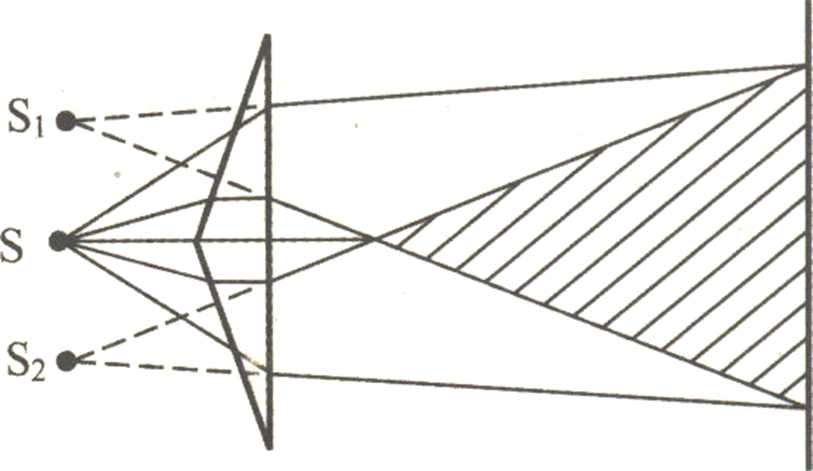
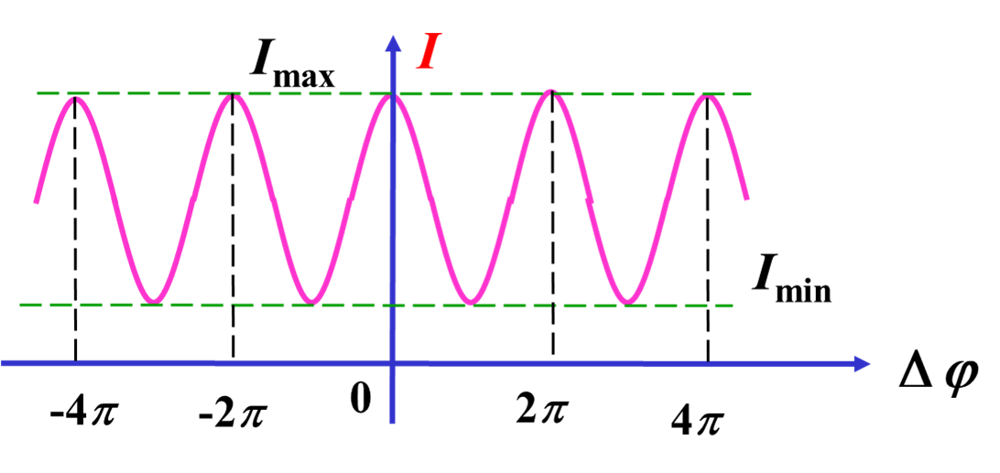

# Chapter 17 光的干涉和衍射

干涉：分立的、有限多的光束的相干叠加

衍射：连续的、无穷多的子光波的相干叠加

## 17.1 光的相干性

### 光源的特性

光源的发光是大量的分子或原子进行的一种微观过程

普通光源发光特点：

- 每一次发光持续时间短
- 发光是随机事件
- 不同原子发的光互相独立
- 同一原子先后发的光互相独立

互相独立：前后发光间隔，频率，相位，振动方向，传播方向都是随机的，都存在差异

### 两列单色光的叠加

光波叠加本质上是电场强度叠加

引入$\vec{E}$ -- 光矢量
$$
\omega_1 = \omega_2 = \omega \quad \vec{E}_1 // \vec{E}_2
$$

$$
E_1 = E_{10}cos(\omega t -k_1r_1+\varphi_{10}) \\
y_2 = E_{20}cos(\omega t -k_2r_2+\varphi_{20}) \\
\vec{E} = \vec{E}_1 + \vec{E}_2 = \vec{E_0}cos(\omega t+\varphi) \\
E_0 = \sqrt{E_{10}^2+E_{20}^2+2E_{10}E_{20}cos\Delta \varphi} \quad
\Delta \varphi = \varphi_{10} - \varphi_{20} + (k_2r_2 - k_1r_1)
$$
结合之前定义过的光强$I \propto E^2$，可得叠加时光强的关系
$$
I = I_1 + I_2 + 2\sqrt{I_1 I_2} cos \Delta \varphi
$$
然后来看相位
$$
k_2r_2 - k_1r_1 = \dfrac{2\pi}{cT}(n_2r_2 - n_1r_1)
= \dfrac{2\pi}{\lambda}(n_2r_2 - n_1r_1)
$$
定义光程差$\delta = n_2r_2 - n_1r_1$，可以得到
$$
\Delta \varphi = \varphi_{10} - \varphi_{20} + \dfrac{2 \pi \delta}{\lambda}
$$

### 光程和光程差的定义

- 当在一种均匀介质中传播时，光程定义为媒质折射率n与光的几何路程r之积
- 当光在多种均匀介质中传播时，总的光程L等于光所经过的介质的光程之和
- **物理意义**：光在折射率为n的介质中传播r的路程所引起的相位的变化，与在真空中传播nr的路程所引起的相位的变化是相同的 $\implies$ 光经过相同的光程所需要的时间是相等的 

$$
L = \sum_{i} n_ir_i
$$

一般光程差
$$
\delta = \sum_{2}n_ir_i - \sum_{1}n_i r_i
$$

### 相干性讨论

#### 非相干叠加

由于前面提到过普通光源的发光特性，所以两个不同的普通光源发出的光往往没有相干性，观察不到干涉现象

#### 相干叠加

相干条件：振动频率相同，振动方向相同，相位差恒定。

两列满足相干条件的光被称为**相干光**：相位差$\Delta \varphi$仅与场点位置有关

相干光的叠加称为**相干叠加**，可观察到干涉现象

#### 从普通光源获得相干光的途径

用普通光源获得相干光的思路是将来自同一原子的同一次发光“一分为二”。也就是说，要将同一光源上同一点或极小区域发出的一束光分成两束，让它们经过不同的传播路径后，再使它们相遇，它们就是相干光。

具体方法有以下几种：

- **分波阵面法**：利用波场中的任一个波前分离出两列波。

- **分振动面法**：利用某些晶体的双折射性质，将一束光分解为振动面垂直的两束光。
- **分振幅法**：利用两个反射面产生两束反射光。

#### 几种干涉方法举例

1. **分波阵面法**

   - 杨氏双缝干涉实验

     

   - 费涅尔双面镜实验

     

   - 费涅尔双棱镜实验

     

   - 洛埃镜实验：当经平面镜反射的光线，与直接射到屏幕上的光相遇，发生干涉，出现干涉条纹。该实验涉及光在反射时的半波损失，后面部分有具体叙述。

     

2. **分振幅法**

   - 薄膜干涉

     

3. **分振动面法**

   - 晶体双折射

### 光程差与干涉图样

假设$\varphi_{10} = \varphi_{20}$，光程差与相位差有如下关系
$$
\Delta \varphi = \dfrac{2 \pi \delta}{\lambda}
$$

- 干涉极大：明纹

$$
\Delta \varphi = 2k\pi \implies \delta = k\lambda \quad k=0,\pm1,\pm2\cdots
$$

- 干涉极小：暗纹
  $$
  \Delta \varphi = (2k+1)\pi \implies \delta = (2k+1)\dfrac{\lambda}{2} \quad k=0,\pm1,\pm2\cdots
  $$

$k$ 称为级次

#### 光反射过程中的半波损失

**半波损失**：当入射光在**光疏媒质中传播遇到光密媒质**时，如果入射角接近于零或90度时，**反射光的电矢量的振动方向相对于入射光的电矢量的振动方向几乎相反，发生$\pi$的相位突变，即产生半波损失**。此时**光程差应加上半个波长**。
$$
\delta = \sum_{2}n_ir_i - \sum_{1}n_i r_i + \dfrac{\lambda}{2}
$$
每发生一次半波损失，加一个$\dfrac{\lambda}{2}$。有$n$​次造成半波损失的反射，就加$\dfrac{n\lambda}{2}$

*注意：折射光没有半波损失

### 干涉条纹的可见度

$$
V=\dfrac{I_{max} - I_{min}}{I_{max} + I_{min}} = \dfrac{2\sqrt{I_1I_2}}{I_1+I_2}
$$

- 当$I_1<<I_2$时，$I_{max} \approx I_{min},V=0$
- 当$I_1 = I_2 = I_0$时，$I_{min} = 0,V=1$

## 17.2 双缝干涉

干涉条件省略不写了

### 双缝干涉光程差计算

前提条件：

缝长>>缝间距，$L >> d$，$x<<L$，简化为平面问题

$\theta$很小，所以可以近似$sin \theta \approx \theta \approx tan\theta \approx d\dfrac{x}{L}$

且假设
$$
\varphi_{10} = \varphi_{20}
$$
光程差和相位差：
$$
\delta = \sum_{2}n_ir_i - \sum_{1}n_i r_i = r_2 - r_1 \approx dsin\theta \approx dtan\theta \approx d\dfrac{x}{L} \\
\Delta \varphi = \dfrac{2 \pi \delta}{\lambda} = \dfrac{2 \pi}{\lambda} d\dfrac{x}{L}
$$
记住光程差结论：
$$
\delta = \dfrac{xd}{L}
$$

### 双缝干涉图案分析

- 干涉极大：光强极大位置，明纹

$$
\delta = k\lambda = \dfrac{xd}{L} \implies x = k\dfrac{L\lambda}{d} \quad k=0,\pm1,\pm2\cdots
$$

- 干涉极小：光强极小位置，暗纹
  $$
  \delta = (2k+1)\dfrac{\lambda}{2} = \dfrac{xd}{L} \implies x = (2k+1)\dfrac{L\lambda}{2d}  \quad k=0,\pm1,\pm2\cdots
  $$

若$I_1 = I_2 = I_0$，光强分布为
$$
I = 2I_0(1+cos\Delta \varphi)
$$
可以得到干涉图样为一系列明暗相间的条纹，中心为明纹

相邻明纹或者暗纹的间距
$$
\Delta x = x_{k+1} - x_{k} = \dfrac{L \lambda}{d}
$$
可以得出结论：（$\theta$不太大时）条纹为等间距分布

### 各种条件对双缝干涉的影响

#### 波长对条纹的影响

由前面的结论
$$
x_k \propto \lambda \quad \Delta x \propto \lambda
$$
如果为复色光，可以当成一堆波长不同的单色光组合在一起去看，结果大概会像这样

#### 缝间距，缝长对条纹的影响

$$
x_k \propto L \quad \Delta x \propto L \\
x_k \propto \dfrac{1}{d} \quad \Delta x \propto \dfrac{1}{d}
$$

#### 干涉条纹可见度

参见前面总体分析

#### 时间相干性

相干条件：**光程差小于波列长度**

相干长度：相干叠加时的最大光程差
$$
L = c \Delta t
$$
相干长度等于波列长度
$$
L = \delta_{max}
$$
相干时间：与相干长度对应的光传播时间

相干时间等于分子或原子每次发光的时间

根据量子力学不确定性，可以得出波列长度，也就是相干长度为
$$
\delta_{max} = \dfrac{\lambda^2}{\Delta \lambda}
$$

#### 空间相干性

光源面积过大→光场中两点失去相干性

考虑下面这个问题：点光源向上（x轴正方向）偏离中轴距离$b$

$$
\delta = d\dfrac{b}{D} + d\dfrac{x}{L} = d(\dfrac{b}{D} + \dfrac{x}{L})
$$
眀纹位置
$$
\delta = k \lambda \implies x = (\dfrac{k\lambda}{d}-\dfrac{b}{D})L
$$
可见，条纹规律不变，条纹间距不变，整体向x轴负方向移动$\dfrac{b}{D}L$

如果原来的光源不是纯粹的点光源，可以将它看成很多个上述的偏移距离$b$不同的点光源叠加在一起。这会导致**可见度下降**

可以考虑一种较为极端的情况：当移动距离恰为条纹宽度时，一个子光源的明纹和另一个子光源的暗纹重合，可见度为零。

这种情况下
$$
\dfrac{b}{D}L = \Delta x= \dfrac{\lambda}{d}L
$$

由此，可以求出光源的极限宽度（临界宽度）
$$
b_{临}=\dfrac{D\lambda}{d}
$$
当$b<b_{临}$时，有干涉条纹

当$b\geq b_{临}$时，干涉条纹消失，变成非相干叠加

### 补充：洛埃镜光程差

注意：洛埃镜涉及反射，有一个半波损失，光程差要加$\dfrac{\lambda}{2}$

也因此，洛埃镜和双缝干涉条纹的相位差相差$\pi$，眀纹暗纹位置完全相反，中心为暗纹
$$
r_2 - r_1 \approx d sin\theta \approx d\dfrac{x}{L}\\
\delta = r_2 -r_1 + \dfrac{\lambda}{2} = d\dfrac{x}{L} + \dfrac{\lambda}{2}
$$

### 补充：菲涅尔双棱镜光程差

将此问题化归为双缝干涉处理

偏向角
$$
\theta \approx (n-1) \alpha
$$
等效光源（双缝）间距和等效光屏距离为
$$
d \approx 2L_1\theta = 2L_1(n-1) \alpha \\
L = L_1+L_2
$$
然后就可以直接套用双缝干涉的结论了
$$
\delta = \dfrac{xd}{L} = \dfrac{2xL_1(n-1)\alpha}{L_1+L_2} \\
\Delta x = \dfrac{Ld}{\lambda} = \dfrac{L_1+L_2}{2L_1(n-1)\alpha}
$$

### 解题技巧

#### 光程差的变化和条纹间距$\Delta x$变化的关系

题目经常有，改变了XX条件，导致条纹间距$\Delta x$变化了$\Delta(\Delta x)$的这种描述

我们需要根据条纹间距$\Delta x$变化了$\Delta(\Delta x)$这个结果推断出光程差变化了多少这个原因，才能进一步做题

直接用下面这个式子，不解释了
$$
\dfrac{\Delta \delta}{\lambda}= \dfrac{\Delta(\Delta x)}{\Delta x} \\
\Delta \delta = \dfrac{\Delta(\Delta x)}{\Delta x}\lambda
$$

## 17.3 薄膜干涉

### 薄膜的等倾干涉

薄膜的等倾干涉指的是点光源照射到表面平整，厚度均匀的薄膜上产生的干涉条纹。

对于厚度均匀的薄膜，扩展光源投射到薄膜上的光线的光程差，是随着光线的倾角（即入射角i）不同而变化的。

倾角相同的光线都有相同的光程差，因而属于同一级别的干涉条纹，这种干涉叫做等倾干涉。

#### 薄膜等倾干涉的光程差计算

注意此处反射过程中的的半波损失：在第一界面的反射为被光疏媒质的反射，无位相突变。 在第二界面反射时为被光密介质的反射，有位相突变$\pi$（即半波损失）

也就是光线2、3间有附加位相差$\pi$，光程差要加$\dfrac{\lambda}{2}$
$$
\delta = \sum_{2}n_ir_i - \sum_{1}n_i r_i + \dfrac{\lambda}{2} = n_2(\overline{ab}+\overline{bc})-n_1\overline{ad} + \dfrac{\lambda}{2} \\
\implies \delta = \dfrac{2en_2}{cos\gamma} - 2e \cdot tan\gamma sini \cdot n_1 + \dfrac{\lambda}{2} \\
\implies \delta = 2e \sqrt{n_2^2 -n_1^2sin^2i} + \dfrac{\lambda}{2}
$$

#### 薄膜等倾干涉图案分析

眀纹暗纹条件参见前面已经写过的通用的光程差与眀暗纹的关系，此处只进行简单分析

眀纹条件
$$
\delta = 2e \sqrt{n_2^2 -n_1^2sin^2i} + \dfrac{\lambda}{2} = k\lambda \\
r = f \tan i
$$

$$
k \uparrow \implies i \downarrow \implies r \downarrow \\
e \uparrow \implies k \uparrow
$$
故等倾干涉条纹有以下特征：

- 等倾干涉图样为明暗相间圆形条纹，条纹**形状**为**一系列同心圆环**
- 条纹间距分布：内疏外密
- 条纹级次内高外低：内圆纹的级次比外圆纹的级次高
- 膜厚变化时，条纹发生移动。当薄膜厚度增大时，圆纹从中心冒出，并向外扩张，条纹变密

### 透射光的干涉

#### 光程差计算

这里两次半波损失抵消
$$
\delta_{45} = 2e \sqrt{n_2^2 -n_1^2sin^2i}
$$
透射光干涉也是明暗相间圆形等倾条纹，形状为一系列同心圆环

不难发现
$$
\delta_{45} = \delta_{23} - \dfrac{\lambda}{2}
$$
可以得出结论：**反射光明暗条纹与透射光的互补**

### 点光源与面光源对等倾干涉的影响

1. 入射角相同的光线分布在锥面上，对应同一级干涉条纹。
2.  面光源上不同点而入射角相同的入射光，都将汇聚在同一级干涉环上（非相干叠加），因而面光源照明比点光源照明条纹明暗对比更鲜明。
3. 比较：和双缝干涉不同，没有光源宽度和条纹可见度的矛盾：光源宽度增加（点光源→面光源）不会导致条纹可见度下降

### 薄膜等倾干涉的应用

#### 增透膜

增透膜的原理是在折射率为$n$的玻璃基片上均匀镀上一层厚度为$d$，折射率为$n_c$的透明介质膜。当波长为$\lambda$的单色光由空气（折射率为$n_0$）垂直入射到介质膜表面上时，介质膜上、下表面的反射光在上表面相遇而发生干涉现象。如果正好是**干涉极小**，则无反射光。根据能量守恒定律，反射光减少，透射光就增强了，就起到了增透的效果。

假设增透膜是为了增强正入射光线，增透膜光学厚度为
$$
2dn_c+\dfrac{\lambda}{2}=\dfrac{2k+1}{2}\lambda \\
\implies d = \dfrac{k\lambda}{2n_c} \quad k=1,2\cdots
$$
若增透膜是为了增强入射角度为$i$的光线
$$
d =\dfrac{k \lambda}{2\sqrt{n_c^2 -n_0^2sin^2i}} \quad k=1,2\cdots
$$
取$k = 1$，得增透膜的最小厚度
$$
d_{min} = \dfrac{\lambda}{2n_c} \\
d_{min} =\dfrac{\lambda}{2\sqrt{n_c^2 -n_0^2sin^2i}}
$$

#### 增反膜（高反射膜）

和增透膜的原理是类似的，无非增透膜是介质膜上、下表面的反射光在上表面相遇时出现干涉极小，而增反膜希望两者出现**干涉极大**

容易计算增反膜的厚度及最小厚度（分别是正入射和入射角度为$i$的光线）
$$
d = \dfrac{2k+1}{4}\dfrac{k\lambda}{n_c}\quad k=0,1,2\cdots \\
d = \dfrac{2k+1}{4} \dfrac{k \lambda}{\sqrt{n_c^2 -n_0^2sin^2i}} \quad k=0,1,2\cdots \\
d_{min} = \dfrac{\lambda}{4n_c} \\
d_{min} =\dfrac{\lambda}{4\sqrt{n_c^2 -n_0^2sin^2i}}
$$
**多层高反射膜**

增反膜是可以叠加的，一层不够可以按照算出来的厚度多涂几层

如果真的考你多层膜计算，要记得哪些看清楚哪些面上的反射有半波损失，哪些面上没有！

在玻璃上交替镀上光学厚度均为$\dfrac{\lambda}{4}$的高折射率ZnS膜和低折射率的MgF2膜，形成多层高反射膜。

### 薄膜的等厚干涉

平行光照射到表面平整，厚度不均匀的薄膜上反射产生的干涉条纹，称为等厚干涉

一组平行光（即入射角$i$一定）投射到薄厚不均匀的薄膜上，其光程差随着厚度$e$而变化，厚度相同的区域，其光程差相同，因而这些区域就出现同一级的干涉条纹，故称为等厚干涉

### 劈尖干涉

劈尖是夹角很小的两个平面所夹的薄膜，夹角一般在
$$
\theta: 10^{-5} \sim 10^{-4} rad
$$
一般情况下只考虑对劈尖的平行光垂直入射

注意一次波疏到波密反射，有一个半波损失

可近似认为波程差
$$
\delta = 2ne+\dfrac{\lambda}{2}
$$
干涉明暗纹，用前面的通用方法判断就行，没啥好说的

$$
条纹间厚度差值\Delta e_k = \dfrac{\lambda}{2n} \\
条纹间距l = \dfrac{\lambda}{2n sin\theta} \approx \dfrac{\lambda}{2n\theta}
$$
直接给几个结论：

1. 干涉图样为明暗相间平行于棱边（劈尖）的等间距的直条纹
2. 条纹级次：厚度越大，级次越高
3. 半波损失：若劈尖处贴合，则劈尖处为0级暗条纹
4. $\theta$越小，间距$l$越大，条纹越稀；$\theta$越大，$l$越小， 条纹越密。当$\theta$大到某一值，条纹密不可分，无干涉
5. 当厚度变化时，干涉条纹会发生移动：薄膜增厚（劈尖上板向上移动），条纹向棱边移动；反之，则远离棱边。
6. 透射光干涉条纹的明暗位置与反射光情形刚好相反

### 劈尖干涉应用

1. 测波长：已知$\theta , n$，测$l$可得$\lambda$
2. 测折射率：已知$\theta,\lambda$，测$l$可得$n$

### 牛顿环

$$
\delta = 2ne+\dfrac{\lambda}{2} \\
e = \dfrac{r^2}{2R}(approx.)
$$
结论：

- 明环
  $$
  r_k = \sqrt{\dfrac{(2k-1)R\lambda}{2n}}
  $$

- 暗环
  $$
  r_k = \sqrt{\dfrac{kR\lambda}{n}}
  $$

条纹特点：

1. 形状：同心圆环

2. 条纹级次分布：半径越大，级次越高。圆心处为0级暗纹

3. 条纹间隔分布：内疏外密。半径越大，间距越小，推导如下
   $$
   \Delta r = \dfrac{R\lambda}{2nr} \Delta k \\
   \Delta k = 1 \implies \Delta r = \dfrac{R\lambda}{2nr} \\
   \Delta r \propto \dfrac{1}{r}
   $$

4. 

### 迈克尔逊干涉仪

#### $M_1$与$M_2$严格垂直——等倾干涉

中心光程差
$$
\delta = 2d
$$
非中心光程差（入射角$i$）
$$
\delta = 2d cosi
$$
两相干光束在空间完全分开，并可用移动反射镜或在光路中加入介质片的方法，改变两光束的光程差。
$$
k \uparrow \implies i \downarrow \implies r \downarrow \\
d \uparrow \implies k \uparrow
$$
条纹从中央冒出(或缩进) $\Delta N$个条纹，M1平移的距离为
$$
\Delta d = \dfrac{\lambda}{2} \Delta N
$$
特点：

1. 条纹级次：内高外低，k自内向外依次递减
2. 内疏外密
3. $d$变化时，条纹发生移动。当$d$增大时，圆纹从中心冒出，并向外扩张，条纹变密。d每增大$\dfrac{\lambda}{2}$，就多冒出一个条纹

#### $M_1$与$M_2$不垂直——等厚干涉

近似为
$$
\delta = 2{d}
$$

#### 应用

1. 测量微小位移
   $$
   \Delta d = \dfrac{\lambda}{2} \Delta N
   $$

2. 测量波长
   $$
   \lambda = \dfrac{2 \Delta d}{\Delta N}
   $$

3. 测介质的折射率

   若在一条光路上放一长度为$l$，折射率为$n$的透明介质

   

   光程差变化为
   $$
   \Delta \delta = 2(n-1)l = \lambda \Delta N
   $$

### 偏振光的干涉

#### $P_1 ⊥ P_2$

##### 振幅关系

$$
A_O = A_1 sin \alpha \quad A_e = A_1 cos \alpha
$$
若$P_1 ⊥ P_2$，则有
$$
A_{2o} = A_1 sin \alpha \cdot cos \alpha \\
A_{2e} = A_1 cos \alpha \cdot sin \alpha
$$

##### 相位关系

o，e光相位差
$$
\Delta \varphi = \dfrac{2 \pi}{\lambda} d \lvert n_o-n_e \rvert + \pi
$$

##### o,e光的干涉

经P2出射的是两束振幅相等，振动方向相同，具有确定相位差的相干光，且它们在空间重合。因此这两束光将发生干涉。

o,e光光程差（设波片厚度为$d$）
$$
\delta = \lvert n_o-n_e \rvert d + \dfrac{\lambda}{2}
$$

- 干涉极大：光强极大位置，明纹

$$
\delta = k\lambda = \lvert n_o-n_e \rvert d + \dfrac{\lambda}{2} \implies d = \dfrac{2k-1}{\lvert n_e - n_o \rvert} \dfrac{\lambda}{2} \quad k=1,2\cdots
$$

- 干涉极小：光强极小位置，暗纹
  $$
  \delta = \dfrac{2k+1}{2}\lambda = \lvert n_o-n_e \rvert d + \dfrac{\lambda}{2} \implies d = \dfrac{k}{\lvert n_e - n_o \rvert} \lambda \quad k=0,1,2\cdots
  $$

####  $P_1 ∥ P_2$

##### 相位差

$$
\Delta \varphi = \dfrac{2 \pi}{\lambda} d \lvert n_o-n_e \rvert
$$

##### o,e光光程差

设波片厚度为$d$
$$
\delta = \lvert n_o-n_e \rvert d
$$

- 干涉极大：光强极大位置，明纹

$$
\delta = k\lambda = \lvert n_o-n_e \rvert d + \dfrac{\lambda}{2} \implies d = \dfrac{2k-1}{\lvert n_e - n_o \rvert} \dfrac{\lambda}{2} \quad k=1,2\cdots
$$

- 干涉极小：光强极小位置，暗纹
  $$
  \delta = \dfrac{2k+1}{2}\lambda = \lvert n_o-n_e \rvert d + \dfrac{\lambda}{2} \implies d = \dfrac{k}{\lvert n_e - n_o \rvert} \lambda \quad k=0,1,2\cdots
  $$

## 17.4  夫琅禾费衍射

### 衍射分类

- 菲涅耳衍射：光源 S距衍射屏（小孔或狭缝）以及观察屏 P 距离衍射屏（小孔或狭缝等）都在有限远处（或观察屏 P在有限远处）

- 夫琅禾费衍射：光源S距衍射屏以及屏幕 P距衍射屏都为“无限远”。

### 单缝的夫琅禾费衍射

只写结论了
$$
I = I_0 (\dfrac{sin \beta}{\beta})^2 \\
\beta = \dfrac{\pi a sin \theta}{\lambda}
$$
求导找极值
$$
\dfrac{dI}{d \beta} = 0 \implies
\begin{cases}
sin \beta = 0 & 极小 \\
tan \beta = \beta & 极大
\end{cases}
$$

#### 衍射眀，暗纹位置

1. 主极大（中央眀纹中心）
   $$
   \theta = 0 \implies \beta = 0 \implies I = I_0 = I_{max}
   $$

2. 极小（暗纹）位置
   $$
   sin \beta = 0 \implies \beta = \pm k \pi \quad k=1,2,3\cdots \\
   \implies a \sin{\theta} = \pm k\lambda \approx a tan \theta = a \dfrac{x_k}{f} \approx a \theta
   $$
   由上面的推导，可得暗纹位置
   $$
   x_k = \pm \dfrac{f}{a} k \lambda \quad
   k=1,2,3\cdots
   $$

3. 高阶极大（眀纹）位置
   $$
   tan \beta = \beta \implies \beta \approx (2k+1)\dfrac{\pi}{2} \\
   \implies a\sin{\theta} = (2k+1)\dfrac{\lambda}{2} \approx a \tan{\theta} = a\dfrac{x_k}{f} \approx a \theta
   $$
   可得高阶眀纹位置
   $$
   x_k = \pm \dfrac{f}{a} (2k+1) \dfrac{\lambda}{2} \quad
   k=1,2,3\cdots
   $$

### 衍射条纹宽度

#### 中央眀纹宽度

易知中央条纹宽度即为第一级暗纹位置之差，故可得中央条纹线宽度和角宽度
$$
\Delta \theta_0 = 2\theta_1 \approx 2 \dfrac{\lambda}{a} \\
\Delta x_0 = 2f\cdot tan \theta_1 \approx 2f \dfrac{\lambda}{a}
$$

#### 其他级眀纹

其他明纹宽度也用暗纹位置之差去算，是中央眀纹宽度的一半
$$
a\dfrac{\Delta x_k}{f} \approx \lambda \\
\Delta x_k = f\dfrac{\lambda}{a} = \dfrac{1}{2} x_0 \\
\Delta \theta_k = \dfrac{\lambda}{a} = \dfrac{1}{2} \theta_0
$$

### 平行光其他方式入射

应该不考，考的话出卷人🐎没了
$$
asin \theta \rightarrow a(sin\theta + sin i) \\
\implies \beta = \dfrac{\pi a (sin \theta+sin i)}{\lambda}
$$

### 单缝衍射特征总结

1. 缝位置变化不影响条纹位置分布
2. 暗纹和中央明纹位置精确，其它明纹位置只是近似
3. 中央亮纹最亮：中央亮纹宽度是其他亮纹宽度的两倍；其他亮纹的宽度相同；亮度逐级下降。

3. $\dfrac{\lambda}{a} \rightarrow 0 \quad \Delta \theta_0 \rightarrow 0$ : 波动光学退化到几何光学
4. $\dfrac{\lambda}{a} \rightarrow 1 \quad \Delta \theta_0 \rightarrow \pi$：观察屏上不出现暗纹
5. $\Delta \theta_0 = 2\theta_1 \approx 2 \dfrac{\lambda}{a}$：波长$\lambda$越长，缝宽$a$越小，条纹宽度越宽

## 17.5 圆孔衍射与光学仪器的分辨本领

### 圆孔的夫琅禾费衍射

理论计算，可得爱里斑对透镜中心的张角$\theta_1$与孔直径$D$和入射光$\lambda$的波长的关系为
$$
D \cdot sin \theta_1 \approx D \theta_1 \approx 1.22 \lambda \\
\implies \theta_1 = \dfrac{1.22 \lambda}{D}
$$
可以得出艾里斑半径为
$$
r = f \tan \theta_1 \approx f \theta_1 = 1.22 \dfrac{\lambda f}{D}
$$

### 光学仪器的分辨力

**最小可分辨张角**即为艾里斑对透镜中心的张角
$$
\delta \theta = \dfrac{1.22\lambda}{D}
$$

**最小可分辨点距**即为艾里斑半径
$$
d_{min} = f \cdot \delta \theta = 1.22 \dfrac{\lambda f}{D}
$$
定义**分辨本领**为
$$
R  =  \dfrac{1}{\delta \theta} = \dfrac{D}{1.22\lambda}
$$

## 17.6 光栅衍射

### 概念

#### 光栅

大量（N条）等宽等间距的平行狭缝(或反射面)构成的光学元件

种类：1.衍射光栅 2.反射光栅

此处主要讨论衍射光栅

#### 光栅常数

$$
d = a + b
$$
$a$是透光（或反光）部分的宽度

$b$是不透光(或不反光)部分的宽度

### 光强结论

直接扔结论了
$$
I(\theta) = I_0 (\dfrac{sin \beta}{\beta})^2(\dfrac{sinN \alpha}{sin \alpha})^2 \\
\alpha = \dfrac{\pi d sin \theta}{\lambda} \quad
\beta = \dfrac{\pi a sin\theta}{\lambda}
$$
$I_0$为单缝衍射最大光强，$\dfrac{sin \beta}{\beta}$为**单缝衍射**因子，$\dfrac{sinN \alpha}{sin \alpha}$是**缝间干涉**因子

这个式子的**物理意义**是：多缝衍射本质上是**单缝衍射**和**多缝干涉**的叠加

**N缝光栅的衍射等效于单缝衍射+N束相干光的干涉**

单缝衍射光强分布前面已经分析过，这里直接分析多缝干涉光强

### 光强分布分析（多缝干涉）

多缝干涉的光强取决于**缝间干涉**因子
$$
J(\alpha) = \dfrac{sinN \alpha}{sin \alpha} \quad \alpha = \dfrac{\pi d sin \theta}{\lambda}
$$

此处省略一系列对$J(\alpha)$求导找极值点的过程，直接给出结论

#### 干涉主极大（眀纹条件）

$$
\alpha = \pm m \pi \quad m =0,1,2\cdots
$$

从而可以推出**光栅方程**
$$
d \sin\theta= \pm m \lambda \quad m =0,1,2\cdots
$$
对应m级主极大

- 光强为单缝的$N^2$倍
- 主极大的最高级数 $sin \theta <1$

$$
m_{max} < \dfrac{d}{\lambda}
$$

- 最多可以看到$2m_{max} + 1$条主极大亮纹（$m_{max}$取符合上述条件的最大整数）

#### 次极大

$$
N \tan \alpha = \tan N \alpha
$$

#### 暗纹条件

$$
sin N\alpha = 0 \implies N \alpha = \pm j' \pi \quad j' = 1,2,3\cdots \\
\implies dsin\theta = \dfrac{j'}{N} \lambda
$$

得出如下结论
$$
令j' = m+j \quad 0<j<N \\
d\sin \theta = \pm(m+ \dfrac{j}{N})\lambda \quad
j = 1,2,3,\cdots,(N-1)
$$

#### 总体特点

1. 相邻两个主极大间有$N-1$个极小（暗纹）

2. 相邻两个主极大间有$N-2$个次极大

3. 第m级主极大的半角宽度如下，可见光栅总缝数越多，主极大条纹越细
   $$
   \Delta \theta_m = \dfrac{\lambda}{Nd\cos \theta_m} \propto \dfrac{1}{N}
   $$

### 缺级现象

**缺级现象：**由于单缝衍射的影响，在应该出现亮纹的地方，不再出现亮纹

缺级现象的原因：多缝干涉的主极大与单缝衍射极小的角位置正好相同。
$$
\begin{cases}
a \sin{\theta} = \pm k\lambda & k=1,2,3\cdots\\
d \sin\theta= \pm m \lambda & m =0,1,2\cdots
\end{cases}
$$
从而可以得出**缺级现象的发生条件**
$$
\dfrac{a}{d}= \dfrac{k}{m}
$$
$\dfrac{a}{d}$是正整数比时，会发生**缺级**！

### 斜入射的光栅方程

$$
d(\sin \theta - \sin i) = \pm m \lambda
$$

分析：

1. 同侧
   $$
   m_{max} < \dfrac{d(1+\sin i)}{\lambda}
   $$

2. 异侧
   $$
   m_{max} < \dfrac{d(1-\sin i)}{\lambda}
   $$

3. $m_{max}$取满足这个两个式子的最大整数
4. 两者相加再+1是能看到的总主极大条纹数

### 光栅分辨颜色的能力

瑞利判据：波长为$\lambda$的m级明纹中央恰好与波长为$\lambda + \Delta \lambda$的m级明纹边缘重合

直接写结论
$$
\Delta \lambda = \dfrac{\lambda}{mN}
$$
由此定义光栅的颜色分辨能力为
$$
R = \dfrac{\lambda}{\Delta \lambda} = mN \propto m,N
$$

### X射线晶体衍射

分析时，可以把晶体直接看作反射光栅处理

两束平行光分别被原子A和B反射，光程差为
$$
\delta = 2 d \sin \theta
$$
其中$\theta$是掠射角（入射X射线角度），$d$为相邻反射原子层的间距，即反射晶面间距

#### 布拉格公式

- 同一晶面上相邻原子散射的在反射方向上的光波光程差为零，相干加强，形成干涉极大，故反射方向强度最大
- 一组晶面，不同层之间的反射相干叠加。若要在反射方向上使得不同晶面的原子散射光相干加强，达到最大强度，需满足**布拉格公式**

- 其实就是晶面不同层之间的光程差满足干涉极大

$$
\delta = 2 d \sin \theta = k \lambda \quad k=1,2,3 \cdots
$$

