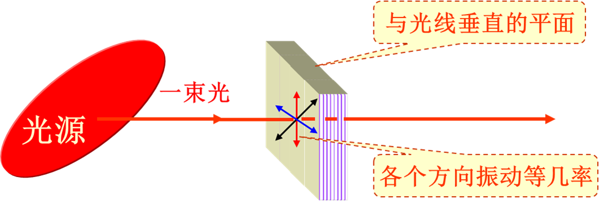
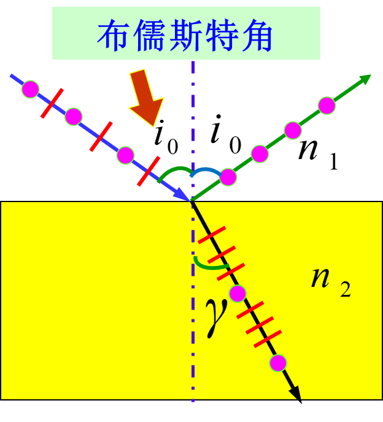
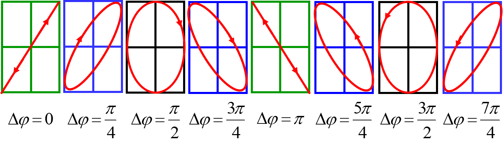
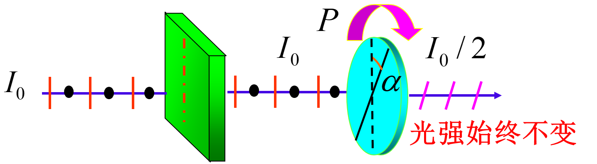

# Chapter 18 光的偏振

## 18.1 光的偏振性

$$
E_x = E_{x0} cos(\omega t -kz+\varphi_1) \\
E_y = E_{y0} cos(\omega t -kz+\varphi_2) \\
\vec{E} = E_x \vec{i} + E_y \vec{j} \\
\Delta \varphi = \varphi_1 - \varphi_2
$$

### 线偏振光

两个分光的相差决定合成光是否为线偏振光

当$\Delta \varphi = 0 或 \pi$时，为线偏振光

$Ex_0$和$Ey_0$的比值决定合成光光矢量与坐标轴的夹角

### 自然光

在观察时间$\Delta t$内，在垂直于其传播方向的平面内，光矢量在哪个方向都不占优势，没有偏振性，它们对其传播方向形成轴对称分布。

自然光可以沿着与光传播方向垂直的任意方向上分解成两束振动方向相互垂直、振幅相等、无固定相位差的非相干线偏振光

### 部分偏振光

完全偏振光和自然光是两种极端情形，介于二者之间的一般情形称为部分偏振光。

做题时，**部分偏振光一般看成自然光部分和线偏振光部分的叠加来处理**（分别分析两部分，再叠加）

### 圆偏振光/椭圆偏振光

**椭圆偏振光**

特征：光矢量绕着光的传播方向旋转，其旋转角速度等于光的角频率；光矢量端点的轨迹是椭圆。

椭圆偏振光可以看成由两个频率相同、振动方向互相垂直、有固定相位差的线偏振光的叠加。

**圆偏振光**是**椭圆偏振光**的特例。

特征：光矢量绕着光的传播方向旋转，其旋转角速度等于光的角频率；光矢量端点的轨迹是一个圆。

### 偏振度

$$
P = \dfrac{I_{max} - I_{min}}{I_{max} + I_{min}}
$$

## 18.2 偏振片，马吕斯定律

### 马吕斯定律

强度为$I_1$的线偏振光，通过检偏器后，透射光的强度为
$$
I_2 = I_1 cos^2 \alpha
$$
其中$\alpha$为检偏器的偏振化方向与入射偏振光的偏振化方向之间的夹角。

### 检偏

### 自然光

$$
I_1 = \dfrac{I_0}{2}
$$

- 自然光在各个方向上的强度都是相同的，检偏后光强与偏振片角度无关

### 线偏振光

就马吕斯定律啊

### 部分偏振光

看成自然光和线偏振光的叠加来处理

## 18.3 反射光和折射光的偏振

自然光在两各向同性媒介分界面上反射和折射时，反、折射光均成为部分偏振光

特点：反射光中垂直入射面的光振动多于平行入射面的光振动，折射光反之。

### 布儒斯特定律

当入射角为某特定值时，反射光为振动方向垂直于入射面的线偏振光。此时有
$$
i_0 + \gamma = 90\degree
$$
通过折射定律，可以导出
$$
\tan i_0 = \dfrac{n_2}{n_1} = n_{21}
$$
$i = i_0$时，反射光为线偏振光，而折射光仍然是部分偏振光，但此时偏振化程度最高

如果想增强折射光的偏振化程度，可让自然光通过玻璃片堆，可使折射光的偏振化程度增加。玻璃片足够多时，可使折射光为完全偏振光

## 18.4 晶体的双折射现象

### 基本概念

**双折射现象**：对于各向异性晶体，一束光射入晶体后，可以观察到有两束折射光的现象。

**o光**：恒遵守通常折射定律的光线 （o for ordinary）

**e光**：不遵守通常折射定律的光线 （e for extraordinary）

- o光折射线一定在入射面内。
- e光折射线不一定在入射面内。

**光轴**：当光在晶体内沿某个特殊方向传播时不发生双折射，该方向称为晶体的光轴。

- **光轴**是一特殊的**方向**，凡平行于此方向的直线均为光轴。

**主平面**：某一光线(o光或e光)与光轴组成的平面

一般情况下，e光不一定在入射面内，o光和e光的主平面并不重合

o光和e光均为线偏振光

- o光的振动方向垂直于它自己的主平面
- e光的振动方向平行于它自己的主平面

### 单轴晶体的波阵面

- o光传播时，电矢量垂直于光轴，所以沿各个方向传播时，振动频率相同，则速度也相同，其波面为球面。
- e光在不同方向传播时，电矢量相对于光轴的方向不同，其振动频率也不同，所以速度也不同，其波面为旋转椭球面。
- o光和e光形成两种不同的波阵面，两种波阵面在光轴方向相切

### o光和e光的折射率

由于**e光在不同方向传播速度不同，折射率也不同**。定义**e光的主折射率**如下：

设e光沿与光轴垂直方向传播时的速度为$v_e$，则其主折射率为
$$
n_e = \dfrac{c}{v_e}
$$
o光的**速度与方向无关，折射率也与方向无关**，定义**o光折射率**为
$$
n_o = \dfrac{c}{v_o}
$$
**o光和e光在晶体的光轴方向传播速度相等，在其他方向两者的传播速度不相等。**

#### 正晶体和负晶体

根据两种光折射率的相对大小，将晶体分为正晶体和负晶体。

- 正晶体：

$$
v_e < v_o \quad n_e > n_o
$$

- 负晶体：
  $$
  v_e > v_o \quad n_e < n_o
  $$

### 各种双折射情况分析

1. 光轴斜交于晶体表面且平行于入射面，正入射

2. 光轴斜交于晶体表面且平行于入射面，斜入射

3. 光轴垂直于晶体表面且平行于入射面，正入射

4. 光轴平行于晶体表面和入射面，正入射

5. 光轴平行于晶体表面且垂直于入射面，正入射

6. 光轴平行于晶体表面且垂直于入射面，斜入射

## 18.5 偏振光的获得

### 波晶片

相位延迟片，常叫波片

晶片是**光轴平行于表面**的**单轴晶体薄片**。

垂直入射光的出射光为同方向但有确定的附加相差的两束线偏振光的合成光。 o光和e光的主平面重合。

#### 光强

入射光的光矢量发生矢量分解（投影），垂直光轴的分量为o光，平行光轴的分量为e光，光矢量大小如下
$$
A_e = A \cos \alpha \quad A_o = A \sin \alpha
$$

由此很容易得到o光，e光光强的与原来光强$I_0$的关系
$$
I_e = I_0 \cos^2 \alpha \quad I_o = I_0 \sin^2 \alpha
$$

#### 光程差

穿过d厚度后，o光和e光的光程差和相位差分别为
$$
\Delta \varphi = \varphi_e - \varphi_o = \dfrac{2\pi}{\lambda}(n_e - n_d)d\\
\delta = (n_e - n_d)d
$$
P.S. 如果原来的入射光在o光和e光方向上就有相位差，那么把此处推导出的结果作为附加的光程差和相位差

#### 出射光的特征

代入上面讨论出射光的光强和光程差的结论
$$
E_x = E_{e} cos(\omega t -kz+\varphi_1 + \Delta \varphi_{波片}) \\
E_y = E_{o} cos(\omega t -kz+\varphi_2) \\
E_e = E \cos \alpha \quad E_o = E \sin \alpha \\
\Delta \varphi = \Delta \varphi_{波片} +(\varphi_2 - \varphi_1)\\
= \varphi_e - \varphi_o +(\varphi_2 - \varphi_1) = \dfrac{2\pi}{\lambda}(n_e - n_d)d +(\varphi_2 - \varphi_1)
$$
出射光的偏振特性由前面计算过的相位差$\Delta \varphi$决定。

相位差$\Delta \varphi$与出射光的偏振特性的关系在18.1中已经提过，如下图。波片的出射光线大部分情况下是椭圆偏振光，特殊情况下是线偏振光。

### 四分之一波片

代入上面的公式，有附加的光程差和相位差
$$
\delta = \dfrac{\lambda}{4} \quad \Delta \varphi = \dfrac{\pi}{2}
$$
结合对于光强的分析
$$
I_e = I_0 \cos^2 \alpha \quad I_o = I_0 \sin^2 \alpha
$$
很容易得出以下这些结论

1. 线偏振光通过$\dfrac{\lambda}{4}$波片后将变为正椭圆偏振光

   

   - 特别地，当$\alpha = \dfrac{\pi}{4}$时，为圆偏振光

2. 圆偏振光通过$\dfrac{\lambda}{4}$波片后可变为线偏振光
   $$
   E_e = E_o \\
   \Delta \varphi_{原} = \dfrac{\pi}{2} \quad
   \Delta \varphi_{后} = \Delta \varphi_{原} + \Delta \varphi = \pi \\
   \Delta \varphi_{原} = \dfrac{3\pi}{2} \quad
   \Delta \varphi_{后} = \Delta \varphi_{原} + \Delta \varphi (= 2\pi) = 0
   $$

3. **主轴（长轴或短轴）与波片光轴平行**的**正椭圆偏振光**通过$\dfrac{\lambda}{4}$波片后变为线偏振光

   

#### 偏振光的检验

1. 区分自然光和圆偏振光

   - 自然光经$\dfrac{\lambda}{4}$波片后仍为自然光，转动检偏器，光强没有变化。

   

   - 圆偏振光经$\dfrac{\lambda}{4}$波片后成为线偏振光，转动检偏器，有最大光强和消光。

   

2. 区分部分偏振光和椭圆偏振光

   - 旋转$\dfrac{\lambda}{4}$波片的光轴方向使之平行于椭圆偏振光的长轴或短轴，经$\dfrac{\lambda}{4}$波片后椭圆偏振光变为线偏振光，转动检偏器，有最大光强和消光。

   

   - 因为部分偏振光有自然光成份，部分偏振光经波片后仍为部分偏振光，转动检偏器，有最大和最小光强，无消光。

   

### 二分之一波片

有附加的光程差和相位差
$$
\delta = \dfrac{\lambda}{2} \quad \Delta \varphi = \pi
$$

1. 线偏振光通过$\dfrac{\lambda}{2}$波片后仍然是线偏振光，但振动方向与原振动方向相比转过$2 \alpha$角

**推广**

线偏振光通过厚度为$\dfrac{\lambda}{2}$的奇数倍的波片后仍为线偏振光，但振动方向与原振动方向相比转过2α角
$$
\delta = (2k+1)\dfrac{\lambda}{2} \quad \Delta \varphi = (2k+1)\pi
$$

2. 圆偏振光通过$\dfrac{\lambda}{2}$波片后仍为圆偏振光，但转动方向与原来的相反

