# Chapter7 波

## 6.2 平面简谐波

原点O的振动式
$$
y = Acos(\omega t + \varphi)
$$
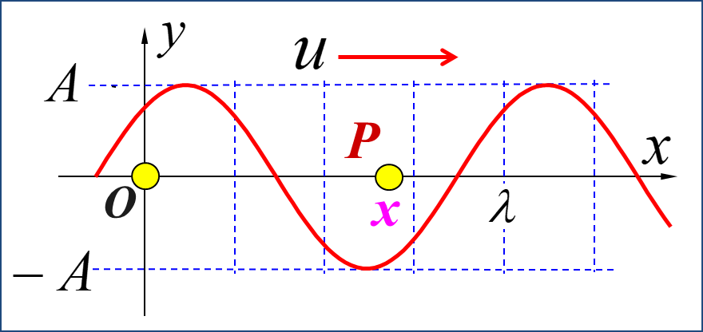

**假设波以速度$u$向x轴正方向传播**

$t-\dfrac{x}{u}$时刻点O的相位$\implies$ t时刻点P的相位
$$
t \rightarrow t-\dfrac{x}{u}
$$
直接就可以得到波函数（行波表达式）：
$$
y = A cos[\omega(t-\dfrac{x}{u})+\varphi] \\
$$
可以改写成平面简谐波的一般形式
$$
y = Acos(\omega t -kx+\varphi)
$$
其中$k = \dfrac{\omega}{u} = \dfrac{2\pi}{\lambda}$

其他表示形式
$$
y = A cos[2\pi(\dfrac{t}{T}-\dfrac{x}{\lambda})+\varphi] \\
$$

**假设波以速度$u$向x轴负方向传播**

很简单，改个符号就是
$$
y = A cos[\omega(t+\dfrac{x}{u})+\varphi]
$$
### 几个物理量的关系（常识）

$u$为波速，$T$为周期
$$
u = \dfrac{\lambda}{T} \quad
\omega = \dfrac{2\pi}{T} \quad
频率v =\dfrac{1}{T}=\dfrac{u}{\lambda} \quad 波长\lambda = uT = \dfrac{u}{v}
$$

软绳中波速
$$
u = \sqrt{\dfrac{F}{\mu}}
$$

### 任意点行波法

给出任意点Q的振动式
$$
y_Q = Acos(\omega t + \varphi)
$$

1. 若波向**x轴正方向**传播

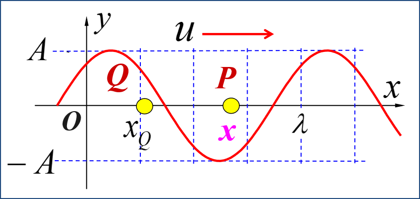
$$
t \rightarrow t-\dfrac{x-x_Q}{u} \\
y = A cos[\omega(t-\dfrac{x-x_Q}{u})+\varphi]
$$

2. 若波向**x轴负方向**传播
   $$
   t \rightarrow t-\dfrac{x+x_Q}{u} \\
   y = A cos[\omega(t-\dfrac{x+x_Q}{u})+\varphi]
   $$

### 行波法物理意义

相距$\Delta x$两点的相位差
$$
\Delta \phi = -\dfrac{\omega}{u}\Delta x = -\dfrac{2\pi}{T} \dfrac{\Delta x}{u} = -2\pi \dfrac{\Delta x}{\lambda}
$$
$\Delta x = x_2 - x_1$可称为波程差

### 平面波动方程

不写了，去数理方法里面探索吧（

## 6.3 简谐波的能量传输

### 质点的能量

质点的能量有动能和势能
$$
dE_k = \dfrac{1}{2} \mu dx(\dfrac{\partial y}{\partial t})^2 \quad
dE_p = \dfrac{1}{2}Fdx(\dfrac{\partial y}{\partial x})^2
$$
其中$\mu$为传播介质的线密度

经过推导，可以发现动能，势能是同步变化的。并且可以得到质点能量
$$
dE_k = dE_p \\
dE = dE_k + dE_p = 2dE_k = 2dE_p \\
= dx \mu \omega^2 A^2 sin^2(\omega t -kx+\varphi) = dx \mu\omega^2(A^2-y^2)
$$

### 机械波的能量

#### 能量密度

机械波的能量密度，即机械波在单位体积中的机械能
$$
\epsilon = \dfrac{dE}{Sdx} = 2 \epsilon_k = 2\epsilon_p = \rho \omega^2 A^2 sin^2(\omega t -kx+\varphi) = \rho\omega^2(A^2-y^2)
$$
其中$\rho = \dfrac{\mu}{S}$，为传播介质的体密度

#### 平均能量密度

$$
\overline{\epsilon} = 2 \overline{\epsilon_k} = 2 \overline{\epsilon_p} = \dfrac{1}{2} \rho \omega^2 A^2
$$

#### 能流密度

单位时间内通过垂直于波传播方向的某一面积的能量称为通过该面积的能流

定义能流$P$为
$$
P = \dfrac{\epsilon Sudt}{dt} = \epsilon S u
$$
能流密度：通过垂直于波传播方向的单位面积的能流
$$
J = \dfrac{P}{S} = \epsilon u
$$
能流密度为矢量，方向与波速方向相同
$$
\vec{J} = \epsilon \vec{u}
$$

#### 强度（平均能流密度）

定义波的强度$I$为
$$
I = \overline{J} = u\overline{\epsilon} = \dfrac{1}{2} \rho \omega^2 A^2 u
$$
不难发现，强度即为平均能流密度

**强度的矢量投影**

强度为$I$的波，传播方向与所看平面的夹角为$\alpha$，则穿过该平面的平均能流密度（强度）为
$$
I' = Icos\alpha
$$
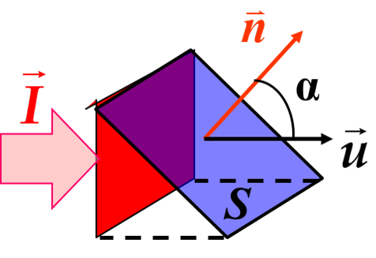

#### 声波的声强级

规定
$$
I_0 = 10^{-12} W/m^2
$$
声强级定义（贝尔Bel，分贝dB）为
$$
L_I = lg\dfrac{I}{I_0} (Bel) \quad
L_I = 10 lg\dfrac{I}{I_0} (dB) \\
1Bel = 10dB
$$

## 6.4 波的叠加和干涉

### 惠更斯原理

惠更斯原理：波阵面上每一点都可以看作是发射子波的波源，在其后的任一时刻，这些子波波阵面的包络面就是该时刻的波阵面—惠更斯原理

#### 用惠更斯原理解释波的衍射

**衍射**：波传播过程中当遇到障碍物时，能绕过障碍物的边缘而传播（偏离直线传播）的现象

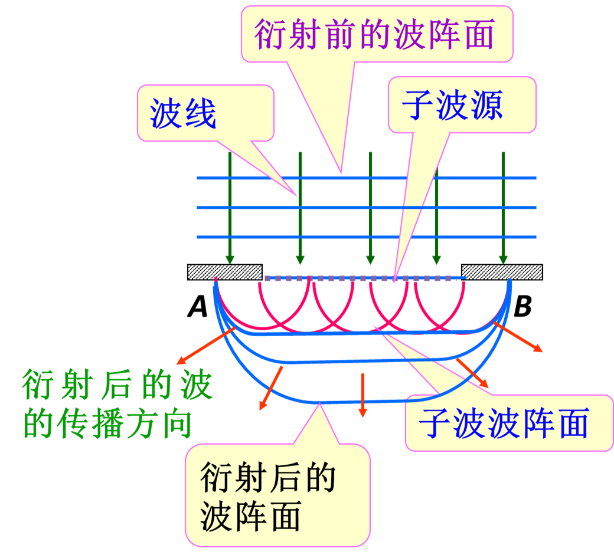

#### 用惠更斯原理解释波的反射

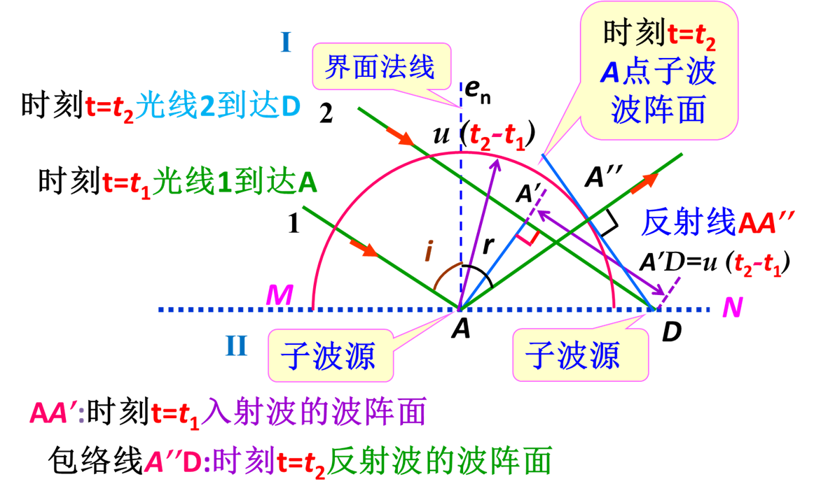
$$
A'D = AA'' \implies r=i
$$
即反射角与入射角相等

#### 用惠更斯原理解释波的折射

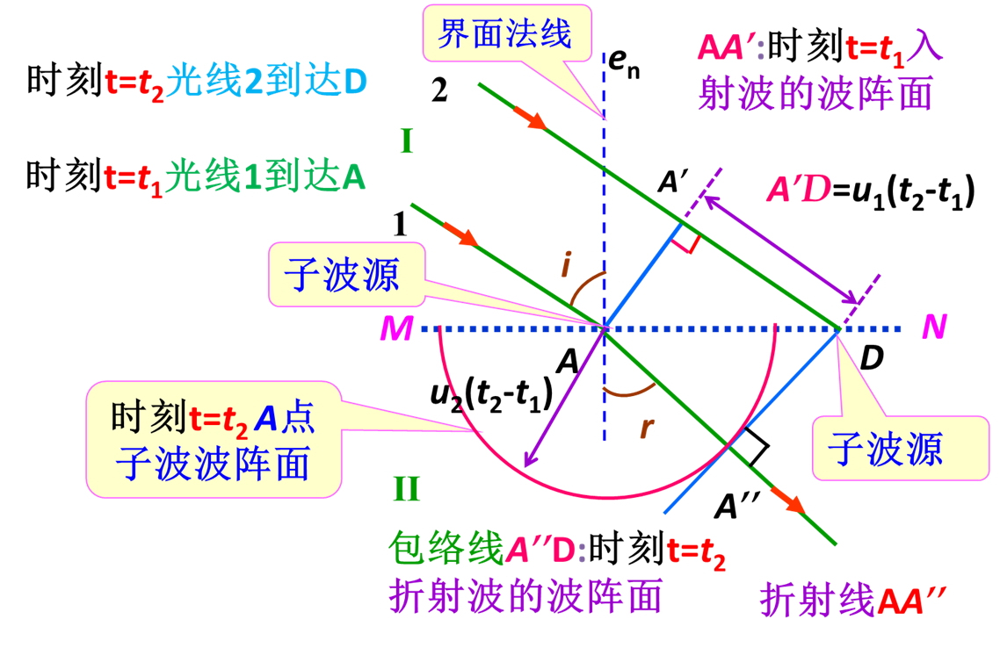

可推出折射定律：
$$
A'D = u_1(t_2-t_1) = ADsini \\
AA'' = u_2(t_2-t_1) = ADsinr \\
\implies \dfrac{sini}{sinr} = \dfrac{u_1}{u_2}
$$

### 波的干涉

相干条件：频率相同，振动方向相同，相位差恒定

波的干涉和振动的叠加类似，也遵循矢量加法原则

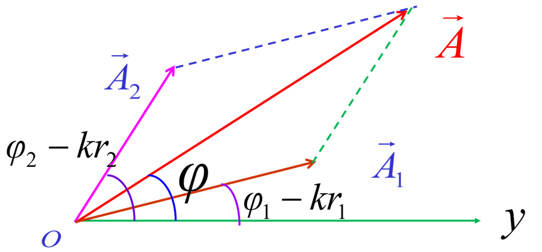
$$
y_1 = A_1cos(\omega t -kr_1+\varphi_1) \\
y_2 = A_2cos(\omega t -kr_2+\varphi_2) \\
y = y_1 + y_2 = Acos(\omega t+\varphi) \\
A = \sqrt{A_1^2+A_2^2+2A_1A_2cos\Delta \Phi} \quad
\Delta \Phi = \varphi_2 - \varphi_1 - k(r_2 - r_1) \\
\varphi = arctan\dfrac{A_1sin(\varphi_1 -kr_1)+A_2sin(\varphi_2 -kr_2)}{A_1cos(\varphi_1 -kr_1)+A_2cos(\varphi_2 -kr_2)}
$$
其中$r_2 - r_1$为波程差

设$\varphi_1 = \varphi_2$

1. 当$r_1-r_2=\pm n\lambda$时，干涉相长：$A = A_1 + A_2$
2. 当$r_1-r_2=\pm (2n+1)\dfrac{\lambda}{2}$时，干涉相消：$A = \lvert A_1 - A_2 \rvert$
3. 其他一般情况：$\lvert A_1 - A_2 \rvert <A< A_1 + A_2$

**提醒**：善用向量叠加的几何意义，减少计算

### 驻波

当两列振幅相同，频率相同，振动方向相同的波以相反方向传播时，叠加形成驻波。
$$
y_1 = Acos(\omega t -kx) \\
y_2 = Acos(\omega t +kx) \\
y = y_1 + y_2 = 2Acoskxcos\omega t
$$
驻波各质点均做简谐振动，但振幅随位置做周期性变化，其中振幅部分即为$2Acoskx$

有些情况，正向传播和反向传播的波有相位差，算一算就行了

**当然，记住三角公式**
$$
\begin{align*}
\sin \alpha \cos \beta &= \frac{1}{2} [\sin(\alpha + \beta) + \sin(\alpha - \beta)] \\
\cos \alpha \sin \beta &= \frac{1}{2} [\sin(\alpha + \beta) - \sin(\alpha - \beta)] \\
\cos \alpha \cos \beta &= \frac{1}{2} [\cos(\alpha + \beta) + \cos(\alpha - \beta)] \\
\sin \alpha \sin \beta &= -\frac{1}{2} [\cos(\alpha + \beta) - \cos(\alpha - \beta)]
\end{align*}
$$

$$
\begin{align*}
\sin \alpha + \sin \beta &= 2 \sin \left(\frac{\alpha + \beta}{2}\right) \cos \left(\frac{\alpha - \beta}{2}\right) \\
\sin \alpha - \sin \beta &= 2 \cos \left(\frac{\alpha + \beta}{2}\right) \sin \left(\frac{\alpha - \beta}{2}\right) \\
\cos \alpha + \cos \beta &= 2 \cos \left(\frac{\alpha + \beta}{2}\right) \cos \left(\frac{\alpha - \beta}{2}\right) \\
\cos \alpha - \cos \beta &= -2 \sin \left(\frac{\alpha + \beta}{2}\right) \sin \left(\frac{\alpha - \beta}{2}\right)
\end{align*}
$$

### 驻波的特征

#### 波腹与波节

$$
y = y_1 + y_2 = 2Acos\dfrac{2\pi x}{\lambda}cos\omega t
$$

- 波腹：
  $$
  \lvert cos\dfrac{2\pi x}{\lambda} \rvert = 1
  \implies x = \pm \dfrac{n}{2} \lambda
  $$

- 波节：
  $$
  cos\dfrac{2\pi x}{\lambda} = 0
  \implies x = \pm \dfrac{(2n+1)}{4} \lambda
  $$
  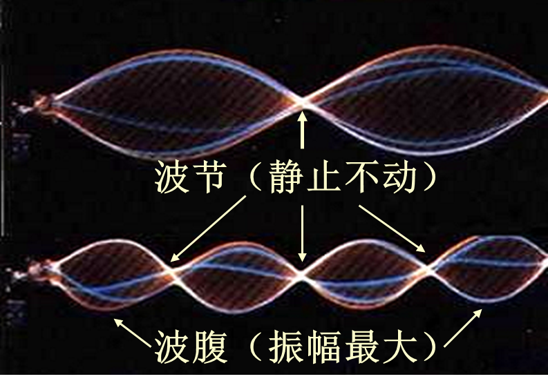

#### 相位特征

$$
y = y_1 + y_2 = 2Acos\dfrac{2\pi x}{\lambda}cos\omega t =
\begin{cases}
2A \lvert cos\dfrac{2\pi x}{\lambda} \rvert cos\omega t & cos\dfrac{2\pi x}{\lambda} \geq 0 \\
2A \lvert cos\dfrac{2\pi x}{\lambda} \rvert cos(\omega t+ \pi) & cos\dfrac{2\pi x}{\lambda}<0
\end{cases}
$$

- 两相邻节点间各质点的振幅部分$cos\dfrac{2\pi x}{\lambda}$的正负号相同，节点两侧各质点的振幅部分$cos\dfrac{2\pi x}{\lambda}$正负号相反
- 两相邻节点间各质点相位相同，节点两侧各质点相位相反

### 驻波的能量

先看单个质点，直接上结论：单个质点的平均机械能守恒，不随时间改变，只和位置有关
$$
dE_k= \dfrac{1}{2}\mu dx(2A\omega cos\dfrac{2\pi x}{\lambda} sin \omega t)^2 \\
dE_p= \dfrac{1}{2}F dx(\dfrac{4 \pi A}{\lambda}\omega sin\dfrac{2\pi x}{\lambda} cos \omega t)^2 \\
\overline{dE_p} = \mu dx(A\omega sin\dfrac{2\pi x}{\lambda})^2 \\
\overline{dE_k} =  \mu dx(A\omega sin\dfrac{2\pi x}{\lambda})^2 \\
\overline{dE} = \overline{dE_p} + \overline{dE_k} = \mu dx (A\omega)^2 = const
$$
由上面的式子可以得出以下结论：

1. 位置与能量的关系

   - 波腹：波腹只有动能
     $$
     dE_p = 0 \quad dE_k = max
     $$

   - 波节：波节只有势能
     $$
     dE_k = 0 \quad dE_p = max
     $$

2. 时间与能量的关系

   - 当所有各点达到最大位移时$cos \omega t = \pm 1$，全部能量为势能
     $$
     dE_k = 0 \quad dE_p = max
     $$

   - 当所有各点达到平衡位置时$cos \omega t = 0$，全部能量为动能
     $$
     dE_p = 0 \quad dE_k = max
     $$

3. 驻波不传递能量，能量只在波腹与波节之间振荡，转移

### 简正模式

**两端固定的张紧弦中产生的驻波**

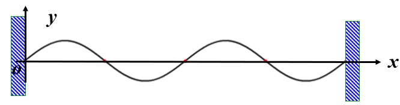
$$
y = y_1 + y_2 = 2Asin\dfrac{2\pi x}{\lambda}cos\omega t \\
y|_{x= 0} = y|_{x=L} = 0 \implies sin \dfrac{2\pi}{\lambda}L = 0 \\
\implies \dfrac{2\pi}{\lambda}L = n\pi  \implies \lambda = \dfrac{2L}{n} \quad n =1,2,3\cdots
$$
P.S. 上面的式子里的sin是因为半波反射，具体看下一节

从而可以得到简正频率
$$
v = \dfrac{u}{\lambda} = \dfrac{nu}{2L} \quad n =1,2,3\cdots
$$
对应的驻波称为弦的简正模或固有振动

### 半波反射和全波反射

$$
入射波:y_1 = Acos(\omega t - \dfrac{2\pi}{\lambda}x +\varphi_1) = A_1 cos \Phi_1 \\
反射波:y_2 = Acos(\omega t +\dfrac{2\pi}{\lambda}x +\varphi_2) = A_2 cos \Phi_2 \\
$$

入射波在**固定端**反射时相位发生突变$\pi$的现象称为**半波损失**。

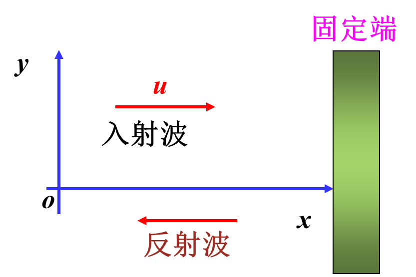

设反射地点$x=L$，有半波反射时
$$
(y_1 + y_2)_{x=L} = 0 \\
\implies (cos \Phi_1+cos \Phi_2)_{x=L} = 0 \\
\implies (\Phi_1 - \Phi_2)_{x=L} = \pm \pi
$$
故可以得出结论：

有半波反射时
$$
(\Phi_1 - \Phi_2)_{x=L} = \pm \pi
$$
无半波反射时
$$
(\Phi_1 - \Phi_2)_{x=L} = 0
$$
显然，是否有半波损失和是固定端还是自由端反射有关：

1. **固定端**反射**有半波损失**，反射面处为波节。故固定端反射为半波反射
2. **自由端**反射**无半波损失**，反射面处为波腹。故自由端反射为全波反射

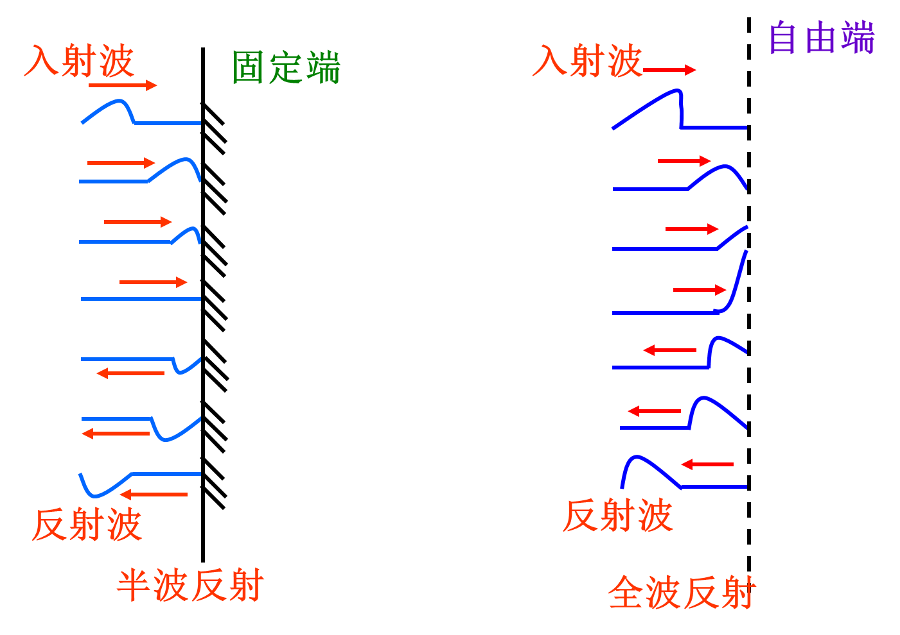

#### 产生驻波的常见方式——反射

一类常见题目的思路：

1. 先写出入射波函数
2. 看反射端是固定端还是自由端：固定端有半波反射，自由端无半波反射
3. 确定反射端位置$x = L$，根据2的判断，写出反射波函数

## 6.5 多普勒效应

### 波源和接收器都静止（废话）

$$
v_s = v_r
$$

### 波源不动，接收器动

设接收器以$v_r$（相对于介质）靠近波源
$$
u' = u + v_r \\
\lambda' = \lambda \\
\implies v_r = \dfrac{u'}{\lambda'} = \dfrac{u+v_r}{\lambda} = \dfrac{u+v_r}{u} v_s
$$
结论：
$$
v_r = \dfrac{u+v_r}{u} v_s
$$

### 波源动，接收器不动

设波源以$v_s$（相对于介质）靠近接收器
$$
\lambda' = \lambda - v_sT = (u-v_s)T = \dfrac{u-v_s}{v} \\
u' = u \\
\implies v_r = \dfrac{u'}{\lambda'} = \dfrac{u}{u-v_s}v_s
$$
结论：
$$
v_r = \dfrac{u}{u-v_s}v_s
$$

### 波源和接收器都动

设接收器以$v_r$（相对于介质）靠近波源，波源以$v_s$（相对于介质）靠近接收器
$$
v_r = \dfrac{u+v_r}{u-v_s} v_s
$$
若$v_s$，$v_r$不在两者连线上
$$
v_r = \dfrac{u+v_r cos\theta_r}{u-v_s cos\theta_s} v_s
$$

### 解题基本思路

1. 确定波源和接收器：实际题目比较复杂，可能有多个波源和接收器，也有可能存在反射，使得一个物体既是波源又是接收器

2. 规定速度正方向，确定$v_s v_r$正负号

   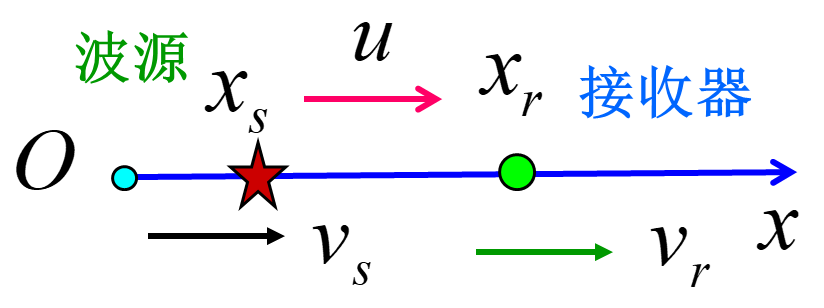

3. 确定速度$v_s$和$v_r$的代数值

4. 确定波源频率$v_s$

5. 代入公式，计算接收器频率
